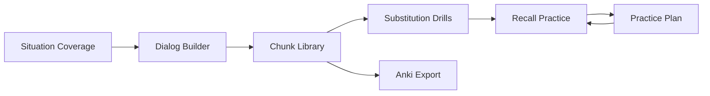

# Features

OpenSen is organized around seven core capabilities covering creation, curation, context, **production**, practice, and portability.

Production — drills and recall — is where the product differentiates. A feature set that stops at "library + spaced repetition" describes a flashcard app.

## Dialog Builder

Generate **memorization-ready dialogs and speeches**.

- Produces multi-turn conversations or monologues structured for chunk extraction
- Output is tuned for recall practice, not open-ended chat
- Serves as the primary entry point for building new material from a goal or scenario

## Chunk Library

A library of **high-frequency native phrases** with **swap patterns**.

- Stores canonical chunks learners should internalize
- Swap patterns mark variable slots inside a frame (e.g. *"I'm allergic to {food}"*)
- Supports reuse across dialogs and situations without relearning the frame

## Situation Coverage

**Real-world scenarios** learners actually encounter.

Examples include:

- Small talk
- Ordering food and drinks
- Travel and directions
- Other situational domains as the catalog grows

Situations anchor chunk selection and dialog generation so practice stays relevant.

## Substitution Drills

**Keep the frame, change the content.** The capability that separates OpenSen from ordinary flashcards.

- Presents variants of a frame, then blanks the slot and requires the learner to fill it
- Trains flexibility rather than recall of one fixed sentence
- Draws candidate fills from validated slot variants, so substitutions stay grammatical

```text
I'm particularly interested in robotics.
I'm particularly interested in generative AI.
→ I'm particularly interested in _____.
```

## Recall Practice

**Produce the language, don't just recognize it.** Four minimum modes:

| Mode | What it trains |
|------|----------------|
| Listen and repeat | Prosody and articulation |
| See L1 → say L2 | Production under retrieval pressure |
| Fill the missing part | Frame stability |
| Change one component | Slot flexibility |

Speech-to-text match rate is enough to start; detailed pronunciation scoring is deliberately out of early scope.

## Practice Plan

**Spaced repetition** schedules for sustained retention.

- Scheduling operates **per chunk**, never per whole dialog
- Prioritizes items due for recall based on forgetting curves (FSRS)
- Grading stays simple: Forgot / Hard / Good / Easy
- Connects library content to daily practice habits

## Anki Export

**Take your chunks anywhere.**

- Export memorization decks compatible with Anki
- Lets learners study on mobile or desktop outside the OpenSen app
- Preserves chunk structure and context where the format allows

## Feature map



Situations inform what to generate; Dialog Builder produces material; Chunk Library holds durable units; Substitution Drills and Recall Practice convert those units into speech; Practice Plan schedules their return; Anki Export extends retention beyond the app.

See [Product strategy](product-strategy.md) for the core loop these features implement and for the capabilities deliberately left out of early scope.
