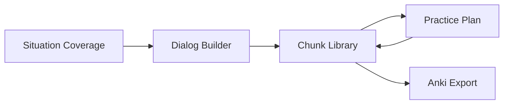

# Features

OpenSen is organized around five core capabilities. Together they cover creation, curation, context, practice, and portability.

## Dialog Builder

Generate **memorization-ready dialogs and speeches**.

- Produces multi-turn conversations or monologues structured for chunk extraction
- Output is tuned for recall practice, not open-ended chat
- Serves as the primary entry point for building new material from a goal or scenario

## Chunk Library

A library of **high-frequency native phrases** with **swap patterns**.

- Stores canonical chunks learners should internalize
- Swap patterns mark variable slots inside a frame (e.g. *"I'm allergic to {food}"*)
- Supports reuse across dialogs and situations without relearning the frame

## Situation Coverage

**Real-world scenarios** learners actually encounter.

Examples include:

- Small talk
- Ordering food and drinks
- Travel and directions
- Other situational domains as the catalog grows

Situations anchor chunk selection and dialog generation so practice stays relevant.

## Practice Plan

**Spaced repetition** schedules for sustained retention.

- Turns chunks and dialogs into a review calendar
- Prioritizes items due for recall based on forgetting curves
- Connects library content to daily practice habits

## Anki Export

**Take your chunks anywhere.**

- Export memorization decks compatible with Anki
- Lets learners study on mobile or desktop outside the OpenSen app
- Preserves chunk structure and context where the format allows

## Feature map

Situations inform what to generate; Dialog Builder produces material; Chunk Library holds durable units; Practice Plan and Anki Export extend retention beyond a single session.
