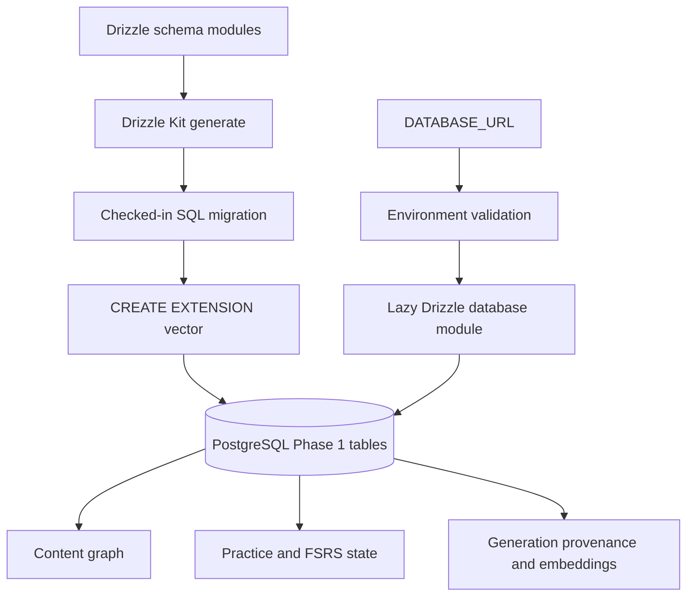

# PostgreSQL Drizzle Phase 1 Schema - Plan

## Goal Capsule

- **Objective:** Add a PostgreSQL data boundary, Drizzle schema, and reproducible Phase 1 migration for the OpenSen content graph and learning engine.
- **Authority:** `docs/database-architecture.md` defines the data model. This plan defines the backend integration and migration shape.
- **Execution profile:** Data-model and migration work. Verify against an empty Neon PostgreSQL database with `pgvector` enabled through `DATABASE_URL`.
- **Stop conditions:** Stop if the target PostgreSQL service cannot create the `vector` extension, or if the chosen embedding dimension is required but not available from product configuration.
- **Tail ownership:** The implementation updates this plan's Definition of Done after verification and moves KEI-141 to review.

---

## Product Contract

### Summary

This plan establishes the durable Phase 1 PostgreSQL schema that lets later API work persist content, generated dialogues, learner attempts, and FSRS scheduling state.

### Problem Frame

The backend has route stubs and an AI dialogue generator but no database layer.
Without a typed schema and executable migration, the content graph, practice engine, and generation provenance cannot persist data consistently.

### Requirements

**Database boundary**

- R1. The backend accepts a non-empty `DATABASE_URL` (Neon PostgreSQL) and exposes one typed Drizzle database module using `@neondatabase/serverless` (`drizzle-orm/neon-http`) for serverless runtime.
- R2. The migration workflow creates the Phase 1 schema on Neon PostgreSQL from checked-in Drizzle definitions and migration artifacts.
- R3. The migration enables `pgvector` before creating the `embeddings.vector` column.

**Content graph**

- R4. The schema models `users`, `user_preferences`, `situations`, `intents`, `sentence_patterns`, `pattern_intents`, `pattern_slots`, `slot_variants`, and `chunks` according to `docs/database-architecture.md`.
- R5. Personal and curated content uses nullable `owner_id`, `visibility`, and nullable `source_template_id` on the four documented ownable entities.
- R6. Slots and pattern-intent associations remain first-class relational rows, not JSON or parsed text.

**Generation and practice**

- R7. The schema models `dialogues`, `dialogue_lines`, `line_chunks`, `ai_generations`, and `embeddings` with the documented Phase 1 foreign-key relationships and provenance fields.
- R8. The schema models `practice_items`, `practice_attempts`, `user_chunks`, and `review_history` with append-only review and attempt records plus FSRS state on `user_chunks`.
- R9. Client-generatable UUID identifiers and mutation timestamps support the documented deferred-write and synchronization model.
- R10. The Phase 1 `embeddings.vector` column uses 1,536 dimensions, matching the initial `text-embedding-3-small` compatibility contract.
- R11. Runtime database access uses a least-privilege application role. Schema and extension DDL use a separate migration role outside local-development fallback.

### Acceptance Examples

- AE1. Given an empty PostgreSQL database that supports `pgvector`, applying the checked-in migrations completes and creates all Phase 1 core and supporting tables.
- AE2. Given a valid `DATABASE_URL`, backend configuration loads it and the database module can establish a query connection in local development.
- AE3. Given a generated migration, the `embeddings` table uses a native `vector(1536)` column after the `vector` extension exists.

### Scope Boundaries

- This plan includes the 14 Phase 1 core tables plus the four supporting tables required by the initial content graph and deduplication: `user_preferences`, `intents`, `pattern_intents`, and `embeddings`.
- This plan does not implement CRUD routes, authentication, authorization, seed data, embedding generation, vector similarity queries, FSRS calculations, or offline conflict replay.
- `audio_assets`, including `audio_asset_id` columns and foreign keys on chunks, dialogue lines, and practice items, remains a Phase 2 addition. Delivery, commerce, and `user_language_profile` also remain in their documented later phases.
- `words` and `chunk_words` are deferred because the documented Phase 1 loop does not read their dictionary fields.

---

## Planning Contract

### Key Technical Decisions

- KTD1. **Use `@neondatabase/serverless` with Drizzle's `neon-http` driver and a Neon `DATABASE_URL`.** The backend runs in Vercel Node.js Functions. Connecting to Neon over HTTP (`drizzle-orm/neon-http`) eliminates TCP connection pooling overhead in serverless environments. If interactive transactions or WebSocket connections are required, `drizzle-orm/neon-websockets` / `neon-serverless` can be used as a seamless extension.
- KTD2. **Make UUID the primary-key strategy for Phase 1 entities and use explicit foreign keys plus uniqueness constraints for join and per-user state tables.** This follows the offline contract and makes relational cardinality enforceable by PostgreSQL.
- KTD3. **Commit an initial custom extension migration before the generated schema migration.** The first migration contains `CREATE EXTENSION IF NOT EXISTS vector`; the next is generated and reviewed from the final Drizzle schema. Drizzle does not create PostgreSQL extensions from TypeScript schema definitions.
- KTD4. **Use Drizzle's native PostgreSQL `vector` column support with 1,536 dimensions and one embedding model in Phase 1.** This fixes compatibility to `text-embedding-3-small`. A provider or dimension change requires an explicit versioned embedding-table/backfill migration; Phase 1 does not mix dimensions in one column.
- KTD5. **Keep database construction lazy and fail configuration validation only when a database consumer initializes it.** Existing routes that do not persist data continue to run without a local database, while migration and database smoke checks require `DATABASE_URL`.
- KTD6. **Load `backend/.env` for Drizzle CLI configuration through `dotenv/config`.** Runtime configuration remains owned by `src/lib/env.ts`. Local generation and migration use `DATABASE_URL`; deployed migrations prefer a direct Neon connection URL (`MIGRATION_DATABASE_URL`) so DDL operations bypass transaction poolers.
- KTD7. **Use Vitest and an explicit `TEST_DATABASE_URL` for database integration checks.** A local Docker Compose pgvector service is the reproducible default. Database tests fail closed when that variable is absent or does not identify the designated test database.
- KTD8. **Keep the database private to the backend service role until authorization work ships.** The migration setup revokes default public schema privileges and grants DML only to the application role. Row-level security and user-specific policies are deferred with the authentication and CRUD work; no direct client database connection is permitted.
- KTD9. **Classify Phase 1 personal data before any production writer is enabled.** AI inputs and outputs, learner-created content, transcripts, and review history require a retention/deletion policy in the future persistence issue. This schema-only issue creates no production write path.

### Assumptions

- The Neon PostgreSQL host permits the `vector` extension. A managed database that does not expose `pgvector` is a blocker rather than a silent fallback to a non-vector column.
- `DATABASE_URL` is the canonical runtime connection variable pointing to Neon in every environment, as documented in `backend/.env.example`.
- `MIGRATION_DATABASE_URL` is an optional deployment-only direct Neon connection for DDL migrations. Local development may use `DATABASE_URL` for both.
- Migration credentials use a direct Neon PostgreSQL connection string when the pooled HTTP/WebSocket endpoint does not support raw DDL migrations.
- `TEST_DATABASE_URL` points only to a disposable `opensen_test` database (or a isolated Neon test branch/database). Integration tests never infer it from `DATABASE_URL`.
- Before implementation, the intended deployment database owner verifies PostgreSQL version, `pgvector` availability, and permission to create the `vector` extension. That environment prerequisite is separate from local test success.
- Phase 1 does not need an approximate-nearest-neighbor index until an embedding query workload and selected distance metric are defined.
- Neon agent tooling comes from the **Neon Cursor Plugin** (MCP/skills bundled in Cursor). Do not commit repo-local `.agents/skills` or `skills-lock.json` for Neon — manual skill installation is not required.

### High-Level Technical Design

### Sequencing

1. Establish dependencies, configuration, and the database composition boundary.
2. Define shared table primitives and Phase 1 schema modules before generating migration output.
3. Generate and review the initial migration, including extension ordering and relational constraints.
4. Add focused configuration and database smoke coverage, then document the local migration workflow.

### Risks & Dependencies

- The embedding dimension is a persistent type choice. Phase 1 fixes it at 1,536 for `text-embedding-3-small` compatibility; changing it later requires a data migration.
- The `vector` extension can fail on an unsupported PostgreSQL host or insufficiently privileged role. The local verification path must prove it early.
- SQL migration generators can emit invalid vector type quoting for some versions or migration shapes. The generated schema migration requires SQL review and a clean-database apply test.
- A transaction-pooled endpoint can be unsuitable for DDL. The migration procedure must use a direct connection when the selected provider requires it.
- A failed migration can leave environment-specific partial DDL depending on the driver and PostgreSQL transaction behavior. The integration workflow must inspect the Drizzle journal, report failure as failure, and document the clean-database retry procedure.
- The repository currently has no database or test framework. The implementation adds only the test tooling and isolated pgvector service required to prove configuration and migration behavior.

### Sources & Research

- `docs/database-architecture.md` owns table inventory, relations, ownership semantics, synchronization constraints, and later-phase exclusions.
- `docs/solutions/tooling-decisions/hono-vercel-over-nestjs.md` requires a thin Hono API that remains compatible with Vercel Functions.
- [Drizzle Neon guide](https://orm.drizzle.team/docs/get-started/neon-new) describes connecting Drizzle to Neon DB via `@neondatabase/serverless` and `drizzle-orm/neon-http`.
- [Drizzle pgvector guide](https://orm.drizzle.team/docs/guides/vector-similarity-search) requires manually managed extension DDL and supports native vector columns.
- [Drizzle PostgreSQL guide](https://orm.drizzle.team/docs/get-started/postgresql-new) describes schema-driven migration generation and application using a connection URL.

---

## Implementation Units

### U1. Establish the Drizzle runtime and Neon DB migration toolchain

- **Goal:** Add `@neondatabase/serverless` and Drizzle ORM dependencies, migration configuration, and a lazy typed database composition module using `drizzle-orm/neon-http`.
- **Requirements:** R1, R2, R11.
- **Dependencies:** None.
- **Files:** `backend/package.json`, `backend/package-lock.json`, `backend/drizzle.config.ts`, `backend/src/lib/env.ts`, `backend/src/db/client.ts`, `backend/.env.example`, `backend/src/lib/env.test.ts`.
- **Approach:**
  1. Add `@neondatabase/serverless`, compatible `drizzle-orm`, `drizzle-kit`, `dotenv`, and Vitest with package scripts for custom migration generation, schema generation, migration application, unit tests, and database integration tests.
  2. Extend the existing Zod environment contract with trimmed `DATABASE_URL` validation without making unrelated route startup require it.
  3. Centralize runtime client construction in `src/db/client.ts` using `drizzle-orm/neon-http` (via `drizzle(process.env.DATABASE_URL)` or `drizzle({ client: neon(...) })`); expose schema-aware Drizzle access optimized for Vercel serverless execution.
  4. Load `dotenv/config` in migration configuration (`drizzle.config.ts`) and point it at the schema entrypoint, generated migration directory, `postgresql` dialect, and validated `MIGRATION_DATABASE_URL` or local `DATABASE_URL`.
  5. Add a preflight command that reports PostgreSQL version, installed `vector` extension state, and extension-creation capability for the target Neon database URL without printing credentials.
  6. Document the application and migration database roles, direct vs pooled connection URLs for Neon, and local single-role execution without committing credentials.
- **Patterns to follow:** `backend/src/lib/env.ts` owns environment parsing; `backend/src/index.ts` keeps framework composition thin.
- **Test scenarios:**
  - A missing or whitespace-only `DATABASE_URL` is rejected when database configuration is requested.
  - A valid PostgreSQL URL is preserved by parsed database configuration.
  - Drizzle CLI configuration loads a valid `DATABASE_URL` from `backend/.env` without leaking its value.
  - Database preflight identifies a target without the `vector` extension or the required create-extension permission before schema migration starts.
  - Runtime configuration cannot select a migration-only connection variable.
  - Importing non-persistent route modules does not open a database connection.
- **Verification:** Type checking passes and the migration CLI resolves the checked-in schema and `DATABASE_URL`.

### U2. Define the Phase 1 relational schema

- **Goal:** Model all documented Phase 1 core and supporting tables with types, relationships, constraints, indexes, and timestamps that enforce the product contract.
- **Requirements:** R4, R5, R6, R7, R8, R9, R10.
- **Dependencies:** U1.
- **Files:** `backend/src/db/schema/index.ts`, `backend/src/db/schema/users.ts`, `backend/src/db/schema/content.ts`, `backend/src/db/schema/generation.ts`, `backend/src/db/schema/practice.ts`, `backend/src/db/schema/schema.test.ts`.
- **Approach:**
  1. Group tables by bounded domain while exporting one schema entrypoint for Drizzle Kit and the database module.
  2. Define user and content ownership columns consistently, including self-referential template-source foreign keys where the architecture requires them.
  3. Define content graph and dialogue joins with composite uniqueness for ordered and membership rows where duplicate associations would violate the model.
  4. Define practice state and immutable logs separately so FSRS source state remains on `user_chunks` while attempts and reviews retain history.
  5. Define JSON fields for documented AI inputs, outputs, and validation metadata; retain queryable relational entities as rows.
  6. Omit Phase 2 `audio_asset_id` fields and foreign keys from the Phase 1 tables; document the deferred relationship in schema comments.
  7. Define `embeddings` with native `vector(1536)` and metadata. Defer vector search indexes until the retrieval metric is specified.
- **Patterns to follow:** `docs/database-architecture.md` sections 1–5 and its Phase 1 inventory are the schema authority.
- **Test scenarios:**
  - The exported schema contains every Phase 1 core and supporting table named by the architecture document.
  - Each ownable entity has nullable owner and source-template foreign keys plus a non-null visibility contract.
  - `pattern_slots`, `pattern_intents`, `line_chunks`, `chunk_words`, `user_chunks`, and `review_history` reject duplicate keys required to be unique.
  - `practice_attempts` and `review_history` reference the documented parent records.
  - Phase 1 tables do not contain `audio_asset_id` foreign keys before the Phase 2 `audio_assets` table exists.
  - `embeddings` exposes native `vector(1536)` without replacing it with an untyped JSON or text field.
  - Learner-mutable tables accept caller-provided UUIDs and carry the documented `updated_at` column; immutable attempt and review rows preserve their creation timestamps.
- **Verification:** Schema metadata generates valid PostgreSQL migration output and compile-time table exports are available to future repositories and routes.

### U3. Generate and validate the initial PostgreSQL migration

- **Goal:** Commit one reproducible initial migration that creates pgvector and the full Phase 1 schema in dependency-safe order.
- **Requirements:** R2, R3, R4, R7, R8, R9, R10, R11.
- **Dependencies:** U1, U2.
- **Files:** `backend/drizzle/0000_*.sql`, `backend/drizzle/0001_*.sql`, `backend/drizzle/meta/*`, `backend/src/db/migrate.ts` or equivalent migration runner, `backend/src/db/migration.integration.test.ts`, `backend/docker-compose.test.yml`.
- **Approach:**
  1. Generate and commit a custom extension migration before generating the schema migration from the final definitions. Preserve Drizzle metadata in version control.
  2. Put idempotent `vector` extension creation in the preceding custom migration, then review generated SQL for valid unquoted vector syntax and foreign-key order.
  3. Provide one explicit migration application path that uses `MIGRATION_DATABASE_URL` where the provider distinguishes direct and pooled endpoints, with `DATABASE_URL` as the local-development fallback, then records applied migration state.
  4. Define an isolated Docker Compose pgvector service with a dedicated `opensen_test` database and pass its URL only as `TEST_DATABASE_URL`.
  5. Revoke default public schema privileges and grant the application role only the table, sequence, and schema-use permissions that Phase 1 runtime access needs.
  6. Keep DDL creation inside migrations; runtime initialization must not create tables or extensions.
- **Patterns to follow:** Drizzle Kit migrations are checked-in artifacts; `backend/.env.example` already establishes `DATABASE_URL` as the local connection contract.
- **Execution note:** Prefer an empty disposable PostgreSQL database with pgvector for this integration proof; it detects extension and DDL defects that schema-only tests cannot.
- **Test scenarios:**
  - Applying migrations to the fresh `opensen_test` database creates the `vector` extension and every Phase 1 table.
  - Reapplying migrations uses migration tracking and does not recreate or corrupt existing schema objects.
  - A database without pgvector reports the extension failure clearly and does not leave a partially accepted migration as success.
  - The integration suite refuses to run when `TEST_DATABASE_URL` is missing or does not point to the designated test database.
  - A deliberately invalid disposable migration reports failure, is absent from the completed-migration journal, and leaves documented cleanup-and-retry steps.
  - A runtime-role connection can query the intended tables but cannot create extensions, alter schema, or access the migration connection string.
  - The resulting `embeddings.vector` column has the native `vector(1536)` type.
  - A migration-backed insert accepts a client-generated UUID and records `updated_at` on `user_chunks`.
- **Verification:** A clean database migration completes through `DATABASE_URL`; inspection confirms tables, constraints, and the vector extension.

### U4. Document local database operations and add a connection smoke path

- **Goal:** Make local developers able to configure PostgreSQL, migrate it, and distinguish a reachable database from an invalid configuration.
- **Requirements:** R1, R2, R11.
- **Dependencies:** U1, U3.
- **Files:** `backend/README.md`, `backend/AGENTS.md`, `backend/.env.example`, `backend/src/db/client.test.ts`, `backend/docker-compose.test.yml`.
- **Approach:**
  1. Document the required PostgreSQL and pgvector prerequisites, database-owner extension preflight, runtime and migration connection variables, generation, migration, validation, and failed-migration recovery commands.
  2. Document the Docker Compose pgvector service and add a narrowly scoped database smoke check that runs only with explicitly supplied `TEST_DATABASE_URL`.
  3. State that the health route remains a liveness check until a later issue deliberately adds readiness semantics.
- **Patterns to follow:** `backend/README.md` owns local commands; `backend/AGENTS.md` requires non-secret environment documentation and `npm run typecheck`.
- **Test scenarios:**
  - With a valid disposable test database URL, the smoke check executes a simple query after migration.
  - With an unavailable or invalid database URL, the smoke check fails with actionable connection context and no secrets.
  - Documentation uses `DATABASE_URL` consistently and never includes credentials.
  - Documentation distinguishes the single Phase 1 embedding model from later dimension-changing migration work.
  - Documentation identifies personal-data categories and states that a retention/deletion policy must be approved before a later issue enables production writes.
- **Verification:** A developer can follow the backend documentation to migrate and smoke-test a local pgvector database without editing source files.

---

## Verification Contract

| Gate | Applies to | Done signal |
|---|---|---|
| Dependency and type check | U1–U4 | `npm run typecheck` passes from `backend/`. |
| Schema generation | U2–U3 | The Drizzle generation command produces no schema or dialect error. |
| Fresh migration integration | U3 | Migration against the isolated pgvector-enabled `opensen_test` database through `TEST_DATABASE_URL` succeeds. |
| Database smoke check | U1, U4 | A post-migration query succeeds using the database composition module and `TEST_DATABASE_URL`. |
| Migration review | U3 | Checked-in SQL creates `vector` before vector-dependent DDL and contains the documented tables, FKs, unique constraints, and indexes. |

---

## Definition of Done

- [x] U1 adds the database toolchain, lazy connection boundary, `DATABASE_URL` validation, `.env` CLI loading, and focused configuration coverage.
- [x] U2 represents all 14 Phase 1 core tables and four required supporting tables in Drizzle with documented relations, constraints, client UUIDs, and synchronization timestamps.
- [x] U3 commits a reviewed initial migration that creates the pgvector extension and applies cleanly to an empty supported PostgreSQL database.
- [x] U4 documents the local workflow and proves a post-migration database connection with the isolated pgvector test service, without exposing secrets.
- [x] `npm run typecheck` passes from `backend/`.
- [x] The generated migration and metadata are committed; no runtime route creates schema objects.
- [x] Verification: `npm test` (11 unit), `npm run test:db` (7 integration) against local PostgreSQL 16 + pgvector; migrations `0000_vector_extension.sql` + `0001_phase1_schema.sql` applied cleanly.
