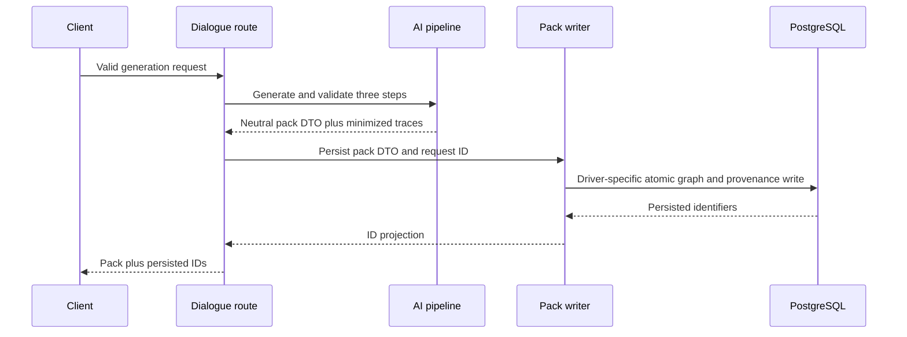

# Persist Generated Dialogue Pack - Plan

## Goal Capsule

- **Objective:** Persist every successfully generated dialogue pack and its AI provenance, then return the database identifiers through `POST /api/dialogues/generate`.
- **Authority:** `docs/database-architecture.md` owns the content graph and provenance model. KEI-138 owns the first writer for that model.
- **Execution profile:** Backend persistence work with unit and disposable PostgreSQL integration coverage.
- **Stop conditions:** Stop production rollout if the endpoint lacks a trusted owner identity or an approved retention and deletion policy for AI input/output.
- **Tail ownership:** Implementation updates this plan's Definition of Done, moves KEI-138 to review, and keeps production enablement blocked until the stated data-governance gates are satisfied.

---

## Product Contract

### Summary

The generator will save the validated situation, dialogue, ordered lines, reusable chunks, and one provenance record for each AI pipeline step.
The endpoint will preserve its generated pack payload and add IDs that identify the rows saved in PostgreSQL.

### Problem Frame

The existing route validates input and obtains a complete AI-generated dialogue pack, but releases it after the request ends.
The product cannot retrieve, practice, audit, or trace that generated content because the content graph and provenance tables are never written.

### Requirements

**Persistence**

- R1. A successful `POST /api/dialogues/generate` persists the generated situation, dialogue, dialogue lines, chunks, and the relational rows required to preserve chunk frames, slots, and slot variants.
- R2. The persisted dialogue references its situation, preserves generated line order, and retains each chunk as a concrete instance of its reusable sentence pattern.
- R3. The handler does not persist only a flattened chunk when doing so would discard its frame, example, slots, or variants.
- R4. All content rows created for one pack either commit together or leave no partial situation, dialogue, chunk, or provenance graph after a write failure.
- R5. A persisted dialogue stores the generation request ID, and `ai_generations` accepts at most one row for each `(request_id, step)` pair.
- R6. Every required relational column has one validated AI field or one documented deterministic mapping. Generated line positions must be contiguous, and returned chunk IDs must correspond to source chunk order.

**API contract**

- R7. The successful response retains the current generated presentation payload and adds one `persistence` object with the situation ID, dialogue ID, request ID, and chunk IDs in source chunk order.
- R8. Invalid request bodies and failed AI generation perform no content write.
- R9. The route fails closed outside the explicitly allowed internal or ephemeral persistence environment when it has no trusted content owner.

**AI provenance**

- R10. Each normalization, dialogue-generation, and chunk-extraction step writes one `ai_generations` row under a shared request ID.
- R11. Each provenance row contains the step, resolved model, versioned prompt and schema identifiers, allowlisted structured input, validated output, and validation outcome.

### Acceptance Examples

- AE1. Given a valid generator request and three successful AI steps, the route returns a situation ID, dialogue ID, and chunk IDs that each resolve to rows in PostgreSQL.
- AE2. Given a saved dialogue pack, its dialogue lines appear in generated order and its chunks retain their pattern, slot, and variant relationships.
- AE3. Given one successful request, exactly three provenance rows share one request ID and identify the three pipeline stages.
- AE4. Given an invalid body, an AI failure, or a child-row insert failure, the request reports failure without a partial content graph.
- AE5. Given a missing trusted owner outside the permitted internal environment, the route writes nothing.

### Scope Boundaries

- This plan writes the existing Phase 1 tables. It does not alter the public generator's language or prompt behavior.
- This plan does not add authentication, user CRUD, embedding generation, embedding-based deduplication, practice items, or retrieval endpoints.
- This plan does not create `line_chunks` rows because the current extraction contract does not identify the dialogue lines that use a chunk.
- This plan does not add a client idempotency key. Retrying a completed request remains a separate public-API contract change.

#### Deferred to Follow-Up Work

- Add authenticated ownership before production traffic can create learner-specific content.
- Define retention, deletion, and access policy for AI prompts, outputs, and generated content before production persistence is enabled.
- Extend extraction with line references before linking chunks to dialogue lines.
- Add embedding generation and duplicate detection as a separate pipeline capability.

---

## Planning Contract

### Key Technical Decisions

- KTD1. **Use a neutral generated-pack persistence DTO between the pipeline and writer.** The route composes dependencies, `src/ai/` produces the DTO and trace, and the database writer consumes it without importing provider or pipeline implementation types.
- KTD2. **Persist the complete representable content graph.** A generated frame becomes a sentence pattern; its slots and variants are rows; its example becomes the concrete chunk. This preserves the first-class slot model instead of flattening extraction output into `chunks`.
- KTD3. **Capture minimized, structured pipeline traces before persistence.** Each trace stores a documented allowlist of generation input and validated output, never rendered system prompts or provider raw text, with fixed prompt and schema version constants.
- KTD4. **Use a driver-specific atomic persistence contract.** PostgreSQL and Neon HTTP paths must each prove one all-or-nothing request boundary before the writer is enabled. The route stays disabled for a driver that cannot meet that invariant.
- KTD5. **Link the dialogue and provenance by request ID with database uniqueness.** The schema adds a dialogue request-ID relation and unique provenance step constraint so a pack has one identifiable successful trace per stage.
- KTD6. **Keep generation output as the response DTO and add an explicit persistence projection.** Database rows are internal; `persistence.chunkIds` remains aligned to source chunk order.
- KTD7. **Fail closed for ownership and governance.** The unauthenticated endpoint can persist only in an explicitly configured internal or ephemeral environment. Production persistence requires a trusted owner, an approved retention policy, and an erasure procedure.

### Assumptions

- The current unauthenticated route is limited to an explicit internal or ephemeral persistence mode. It is disabled otherwise until an authenticated principal supplies ownership for personal content. `owner_id = NULL` must not silently become a production policy for learner prompts.
- The first persistence pass records only successful, Zod-validated AI steps. Capturing provider and validation failures as durable provenance needs a separately defined failure-write boundary because the current pipeline throws before a complete pack exists.
- The generation contract will add or deterministically derive `situations.category`, pattern difficulty, slot expected part-of-speech, variant meaning and level, chunk type and level, and dialogue attribution. Fixtures validate every mapping before a write starts.
- Prompt and schema version constants are stable identifiers maintained beside the pipeline contracts. Cost and latency remain nullable until the provider supplies reliable values.

### High-Level Technical Design

### Sequencing

1. Define the neutral DTO, complete mappings, minimized trace contract, and schema constraints.
2. Implement and prove atomic persistence independently for every enabled runtime driver.
3. Compose the route through injectable pipeline and writer dependencies, then project persisted IDs into the additive response field.
4. Prove API behavior, foreign keys, provenance grouping, failure rollback, and fail-closed ownership behavior.

### Risks & Dependencies

- `getDatabase()` currently returns Neon HTTP or postgres.js clients. Each enabled driver needs a tested atomic mechanism; local postgres.js coverage alone cannot prove the Neon path.
- The schema has no ID defaults. Every row in the graph needs an application-generated UUID before dependent inserts.
- The current normalized situation lacks a required category, and extraction does not directly supply all required content fields. Unreviewed defaults would make data quality drift permanent.
- AI requests and outputs may contain learner-specific data. The existing backend documentation forbids production writers without approved minimization, retention, deletion, ownership, and separated migration/application-role policies.

### Sources & Research

- `docs/database-architecture.md` defines the content graph, ownership semantics, and one-row-per-step provenance requirement.
- `docs/plans/2026-08-09-001-feat-postgres-drizzle-phase-1-plan.md` establishes the completed Phase 1 schema and database test workflow.
- `docs/solutions/architecture-patterns/postgres-drizzle-phase1-neon-pgvector.md` defines lazy database construction and Neon/local driver constraints.
- `backend/src/routes/dialogues.ts` and `backend/src/ai/pipeline/generate-dialogue.ts` define the current stateless generator boundary.
- [Drizzle Neon documentation](https://orm.drizzle.team/docs/connect-neon) and [batch API documentation](https://orm.drizzle.team/docs/batch-api) inform the driver-specific atomic-write investigation.

---

## Implementation Units

### U1. Define the generated-pack contract and capture minimized traces

- **Goal:** Return a neutral persistable pack DTO and one minimized, versioned trace for each validated AI step.
- **Requirements:** R6, R10, R11.
- **Dependencies:** None.
- **Files:** `backend/src/dialogue-packs/generated-pack.ts`, `backend/src/dialogue-packs/generated-pack.test.ts`, `backend/src/ai/pipeline/generate-dialogue.ts`, `backend/src/ai/pipeline/schemas.ts`, `backend/src/ai/types.ts`, `backend/src/ai/pipeline/generate-dialogue.test.ts`.
- **Approach:**
  1. Define an AI-independent DTO that fully represents required content fields and successful provenance data.
  2. Extend generation schemas or use documented deterministic mappings for every non-null relational column.
  3. Validate contiguous dialogue positions, unique slot names and positions, and source chunk ordering before persistence.
  4. Allowlist trace fields and record resolved model plus stable prompt/schema versions without persisting raw provider text or rendered prompts.
- **Patterns to follow:** `backend/src/ai/AGENTS.md` requires Zod validation for every domain-producing model call and provider-agnostic route use.
- **Test scenarios:**
  - A fake provider that returns valid outputs yields three ordered traces with the expected step names and models.
  - Each trace records allowlisted structured input and the Zod-validated output received from it.
  - A malformed provider output rejects the pipeline before it returns a persistable pack.
  - Fixtures cover every required situation, pattern, slot, variant, chunk, and dialogue column.
  - Gapped or duplicated dialogue positions and invalid slot data reject before the writer starts.
- **Verification:** Unit coverage proves trace completeness without calling a real provider.

### U2. Add schema invariants and an atomic generated-pack writer

- **Goal:** Persist one complete generated pack and successful provenance graph through the lazy database boundary.
- **Requirements:** R1, R2, R3, R4, R5, R6, R10, R11.
- **Dependencies:** U1.
- **Files:** `backend/src/db/schema/generation.ts`, `backend/drizzle/*`, `backend/src/db/dialogue-pack-writer.ts`, `backend/src/db/dialogue-pack-writer.test.ts`, `backend/src/db/dialogue-pack-writer.postgres.integration.test.ts`, `backend/src/db/dialogue-pack-writer.neon.integration.test.ts`, `backend/src/db/client.ts`.
- **Approach:**
  1. Add the request-ID relation from dialogue to provenance and uniqueness constraints that prevent duplicate stage rows.
  2. Allocate UUIDs and map the DTO to the existing content graph and successful provenance rows.
  3. Encapsulate the selected all-or-nothing mechanism for each supported driver behind one writer interface.
  4. Return only the persisted-ID projection.
  5. Keep embeddings, line-to-chunk links, and client-request idempotency outside this writer's active scope.
- **Patterns to follow:** `backend/src/db/client.ts` owns lazy client creation; `backend/src/db/schema/content.ts` and `backend/src/db/schema/generation.ts` own table contracts.
- **Test scenarios:**
  - A deterministic pack writes a situation, dialogue, ordered dialogue lines, pattern rows, slot rows, variant rows, chunk rows, and three provenance rows with one request ID.
  - Each returned ID equals the ID stored in its corresponding row and every foreign key points to the expected parent.
  - The chunk example maps to the concrete chunk while its frame, slots, and variants remain queryable through pattern tables.
  - A forced failure after every graph write phase rolls back all rows for the preallocated IDs and request ID.
  - Duplicate provenance step insertion fails, and the saved dialogue joins to exactly its three successful provenance rows.
  - The writer does not create embeddings or `line_chunks` rows.
- **Verification:** PostgreSQL and Neon HTTP integration coverage each proves table contents, foreign keys, shared provenance request ID, uniqueness, and atomic rollback.

### U3. Compose guarded persistence into the dialogue generator route

- **Goal:** Make the live generator write a complete pack only after AI generation succeeds and return persisted identifiers.
- **Requirements:** R1, R4, R7, R8, R9.
- **Dependencies:** U1, U2.
- **Files:** `backend/src/routes/dialogues.ts`, `backend/src/routes/dialogues.test.ts`, `backend/src/lib/env.ts`, `backend/src/lib/env.test.ts`, `backend/.env.example`.
- **Approach:**
  1. Introduce a route factory or equivalent composition seam so tests supply fake provider, pipeline, writer, and database dependencies.
  2. Retain request validation and construct database access only when the guarded writer path is allowed.
  3. Invoke the writer only after the pipeline supplies a fully validated DTO and trace.
  4. Return the explicit additive persistence projection while leaving generated fields unchanged.
  5. Fail closed before generation or writing when runtime mode lacks a trusted owner and is not designated internal or ephemeral.
- **Patterns to follow:** `backend/src/routes/dialogues.ts` is the current Hono orchestration edge; `backend/src/lib/errors.ts` centralizes HTTP error responses.
- **Test scenarios:**
  - A valid permitted request with fake dependencies returns `201`, the original generated pack, and a source-order-aligned persistence projection.
  - Invalid JSON and invalid request payloads do not invoke the provider or writer.
  - A provider failure does not invoke the writer.
  - A writer failure returns the existing safe server-error contract and does not expose connection details.
  - A missing trusted owner in a disallowed runtime mode does not call the writer or open a database connection.
- **Verification:** Route unit tests prove invocation ordering and response compatibility.

### U4. Prove operational behavior and document rollout gates

- **Goal:** Verify the persistence flow against the project database harness and document its pre-production limits.
- **Requirements:** R4, R5, R7, R9, R10, R11.
- **Dependencies:** U2, U3.
- **Files:** `backend/src/routes/dialogues.integration.test.ts`, `backend/README.md`, `backend/AGENTS.md`.
- **Approach:**
  1. Add a migrated test-database route scenario that exercises a fake provider and verifies the public persistence projection.
  2. Document internal-mode restrictions, trusted ownership, data minimization, retention, request-bundle erasure, and production approval as rollout gates.
  3. Preserve the existing separation of migration and runtime credentials.
- **Patterns to follow:** `backend/src/db/migration.integration.test.ts` and `backend/src/db/client.integration.test.ts` require explicit `TEST_DATABASE_URL` and a pgvector-enabled disposable database.
- **Test scenarios:**
  - The integration suite rejects a missing or non-designated test database URL before persistence testing starts.
  - A migrated disposable database contains the complete persisted graph, and the public IDs resolve to it.
  - Repeated independent requests receive distinct request IDs and do not cross-link their provenance rows.
  - Documentation describes retention/deletion approval, request-bundle erasure, and trusted ownership as deployment gates without recording secrets.
- **Verification:** Database tests pass only against the designated disposable database, and operational documentation states the pre-production requirements.

---

## Verification Contract

| Gate | Applies to | Done signal |
|---|---|---|
| Type check | U1–U4 | `npm run typecheck` passes from `backend/`. |
| Unit tests | U1–U3 | `npm run test` passes, including pipeline, writer, and route coverage. |
| Database integration | U2, U4 | `npm run test:db` passes with `TEST_DATABASE_URL` targeting a disposable pgvector database. |
| Atomicity proof | U2 | A forced child-row failure leaves no graph or provenance rows for that request. |
| API contract | U3 | A permitted successful request retains generated data and returns an explicit persistence projection that matches persisted rows. |
| Ownership guard | U3 | A disallowed runtime mode cannot construct the database or write ownerless learner-derived content. |
| Rollout review | U4 | Trusted ownership, minimized provenance fields, retention/deletion policy, and request-bundle erasure procedure are approved before production traffic uses the writer. |

---

## Definition of Done

- [x] U1 exposes a complete mapping contract and minimized, versioned trace for every successful AI pipeline step.
- [x] U2 adds request/provenance invariants and atomically writes the complete representable content graph for every supported driver.
- [x] U3 returns an explicit persistence projection without breaking the current generated-pack response and fails closed when ownership is unavailable.
- [x] U4 adds disposable-database coverage and documents production rollout gates.
- [x] `npm run typecheck`, `npm run test`, and `npm run test:db` pass.
- [x] No AI provider client or database connection is constructed outside its established boundary.
- [ ] Production enablement has a trusted ownership source plus approved minimization, retention, deletion, and request-bundle erasure policy for AI and generated-content data.
