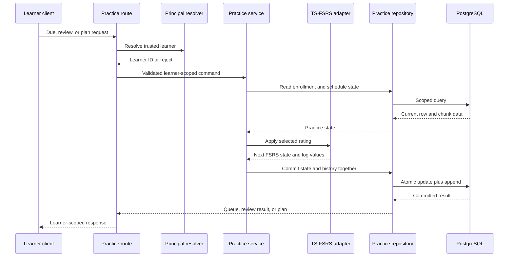

# FSRS Practice Review Engine - Plan

## Goal Capsule

- **Objective:** Replace the practice route stubs with per-learner FSRS review APIs for due chunks, submitted ratings, and queue progress.
- **Authority:** `docs/product-strategy.md` defines the four ratings and requires FSRS. `docs/database-architecture.md` owns persisted practice state and history. KEI-140 owns API behavior.
- **Execution profile:** Backend domain, persistence, and HTTP-contract work with unit and disposable PostgreSQL integration coverage.
- **Stop conditions:** Do not enable a production writer until a trusted authenticated principal is available. Do not accept a client-provided user identifier as ownership evidence.
- **Tail ownership:** Implementation updates this plan's Definition of Done, links its PR to KEI-140, and moves KEI-140 to In Review.

---

## Product Contract

### Summary

The backend will expose a cursor-paginated due queue, one atomic rating submission path, and a progress summary for chunks already enrolled for a learner.
It will use `ts-fsrs` for every schedule transition and retain the scheduler's durable state plus an append-only review record.

### Problem Frame

The practice route currently returns an empty due list and reports the review and plan endpoints as unimplemented.
The Phase 1 schema already stores FSRS state, but no API reads it, applies a rating, or provides progress to the learner.

### Requirements

**Due queue**

- R1. `GET /api/practice/due` returns the caller's enrolled chunks whose `next_review` is at or before the request time, including enrolled chunks in the `new` state with no scheduled review.
- R2. The due queue orders items deterministically by due time and stable chunk identity, returns an opaque cursor for a following page when more rows exist, and enforces a default page size of 20 with a maximum of 100.
- R3. The due queue never returns another learner's scheduling state or content, and returns chunk content only when it is public or owned by the authenticated learner.

**Review scheduling**

- R4. `POST /api/practice/reviews` accepts exactly one valid rating: Forgot, Hard, Good, or Easy.
- R5. A submitted rating maps the persisted state to a TS-FSRS card, obtains the selected next scheduling result from `ts-fsrs`, and maps the resulting state back to `user_chunks`.
- R6. One accepted review atomically updates the mutable `user_chunks` state and appends one `review_history` row containing the submitted rating, state before review, elapsed days, scheduled days, and review time.
- R7. The API derives intervals from FSRS state and timestamps. It does not add a stored interval as a competing scheduling source of truth.
- R8. A request cannot review a chunk that is not enrolled by the authenticated learner. Malformed input and rejected ownership do not write either table.

**Progress**

- R9. `GET /api/practice/plan` returns a learner-scoped summary of enrolled chunks by FSRS state plus the current due count and reviews completed in the current UTC day.
- R10. All practice endpoints fail closed when a trusted principal is unavailable.

### Acceptance Examples

- AE1. Given an enrolled chunk that is due, requesting the due queue returns that chunk once in due-time order and does not reveal another learner's identical chunk enrollment.
- AE2. Given a valid Good rating for an enrolled chunk, submitting the rating changes its FSRS state and writes one matching immutable review-history row.
- AE3. Given an invalid rating, unknown chunk, or missing principal, submitting a review leaves scheduling state and review history unchanged.
- AE4. Given chunks in new, learning, review, and relearning states, the practice plan reports each state count, the due count, and today's completed-review count.

### Scope Boundaries

- This plan implements APIs only for existing `user_chunks` enrollment rows and existing chunk content.
- This plan does not add authentication, user registration, chunk enrollment, practice-item generation, transcript capture, offline review replay, scheduler-parameter administration, or personalized retention targets.
- This plan does not alter the Phase 1 practice schema unless integration research proves a field is insufficient to faithfully round-trip the TS-FSRS card contract. A migration is not assumed.

#### Deferred to Follow-Up Work

- Compose the trusted authentication provider that supplies the practice principal in deployed requests.
- Add offline log reconciliation by replaying review history in timestamp order.
- Generate `practice_items` and persist `practice_attempts` before ratings so the review log can link to production-practice evidence.
- Tune FSRS parameters from observed review history after enough learner data exists.

---

## Planning Contract

### Key Technical Decisions

- KTD1. **Use the current `ts-fsrs` package as the only scheduler.** The practice domain adapts database rows to TS-FSRS cards and ratings rather than recreating interval, stability, or difficulty formulas. The public Forgot rating maps to `Rating.Again`; Hard, Good, and Easy map directly. This satisfies R4–R7 and the product requirement to not hand-roll FSRS.
- KTD2. **Keep scheduling state mutable on `user_chunks` and treat `review_history` as append-only evidence.** Derive elapsed and scheduled days from the persisted review timestamps when creating the card and log entry. Do not introduce a stored interval. This satisfies R5–R7.
- KTD3. **Put FSRS mapping and practice orchestration behind pure domain interfaces.** The Hono route resolves the actor and request data. A database adapter owns Drizzle queries and atomic writes. The scheduler adapter and use cases remain independent of Hono and Drizzle.
- KTD4. **Require an injected trusted practice principal and fail closed in default route composition.** Unit and integration tests inject a known principal. Production activation waits for the authentication issue to install a resolver. A request body, query string, or arbitrary header cannot select another user's state. This satisfies R3, R8, and R10.
- KTD5. **Use an opaque cursor derived from the ordered due boundary.** Stable ordering by effective due timestamp and chunk ID prevents duplicate or missing rows between normal page requests without exposing database query structure.
- KTD6. **Cap due pages at 100 items.** The API defaults to 20 items and validates the client limit before querying. This bounds the joined response while keeping the existing cursor shape.
- KTD7. **Encapsulate the review write in one driver-aware repository operation.** The adapter must prove that `user_chunks` update and `review_history` insert commit or fail together for each enabled database driver. It must condition the write on the persisted scheduling revision so duplicate or concurrent submissions cannot append history for a stale state. This follows the established Neon/postgres.js persistence boundary.

### Assumptions

- Enrolled `new` rows with `next_review = NULL` are immediately due. Enrollment itself is created by another capability.
- The first progress summary uses UTC for the daily review boundary because the current user schema has no time-zone field.
- Default TS-FSRS parameters are used initially. Per-user or remotely stored parameter sets are outside this issue.
- The review endpoint receives one chunk rating per request. Batch synchronization remains part of offline replay work.

### High-Level Technical Design

### Sequencing

1. Establish the package, domain contracts, trusted-principal seam, and TS-FSRS state mapping.
2. Add the learner-scoped repository with deterministic due selection, aggregate progress reads, and an atomic review write.
3. Compose the three HTTP handlers through injectable dependencies and validate their request, ownership, and cursor contracts.
4. Prove pure scheduling behavior, route behavior, and persisted transaction invariants using the existing disposable database harness.

### Risks & Dependencies

- No authentication middleware exists today. This plan deliberately keeps deployed production writes unavailable until a trusted principal resolver is composed.
- `ts-fsrs` requires Node.js 20 or later. The backend deployment and test runtime must meet that package prerequisite before installation.
- The current schema does not store every transient TS-FSRS card field. The mapper must be validated against real package types before deciding whether the existing timestamps and state fields faithfully preserve future transitions.
- Neon HTTP and postgres.js expose different transaction capabilities. An atomicity proof must cover every driver enabled for practice writes, not only the local test driver.
- The issue description requests statistics but does not define a time zone or retention target. The initial UTC and default-parameter assumptions must remain visible until product settings exist.

### Sources & Research

- `docs/product-strategy.md` requires chunk-level FSRS with Forgot, Hard, Good, and Easy ratings.
- `docs/database-architecture.md` defines `user_chunks` as mutable FSRS state, `review_history` as append-only, and interval as a derived value.
- `docs/solutions/architecture-patterns/postgres-drizzle-phase1-neon-pgvector.md` defines lazy database access and driver-specific persistence constraints.
- `backend/src/routes/dialogues.ts` and `backend/src/routes/dialogues.test.ts` show the injectable Hono router composition pattern.
- [TS-FSRS documentation](https://open-spaced-repetition.github.io/ts-fsrs/) specifies `fsrs()`, `createEmptyCard()`, `next()`, the four ratings, and Node.js 20 support.

---

## Implementation Units

### U1. Define the practice domain, ownership seam, and FSRS adapter

- **Goal:** Add a pure practice module that validates ratings, maps durable state to and from TS-FSRS, and accepts a trusted learner identity through a narrow interface.
- **Requirements:** R4, R5, R7, R8, R10.
- **Dependencies:** None.
- **Files:** `backend/package.json`, `backend/package-lock.json`, `backend/src/practice/AGENTS.md`, `backend/src/practice/fsrs-scheduler.ts`, `backend/src/practice/fsrs-scheduler.test.ts`, `backend/src/practice/practice-service.ts`, `backend/src/practice/practice-service.test.ts`.
- **Approach:**
  1. Install `ts-fsrs` at its current compatible release and confirm the backend runtime requirement.
  2. Define domain request, result, clock, principal, and repository contracts without importing Hono or Drizzle.
  3. Map `new`, `learning`, `review`, and `relearning`, timestamps, stability, difficulty, repetitions, and lapses between the database model and TS-FSRS.
  4. Convert the four public rating names to the package rating enum at the adapter boundary.
  5. Add the local DOX contract for the new practice-domain boundary, including its dependency direction and verification ownership.
- **Patterns to follow:** `backend/src/dialogue-packs/generated-pack.ts` for validated domain DTOs; `backend/src/routes/dialogues.ts` for explicit dependency injection.
- **Test scenarios:**
  - A new due enrollment rated Good produces a valid next FSRS state and non-null next-review time.
  - Each of Forgot, Hard, Good, and Easy maps to exactly one TS-FSRS rating and yields a distinct valid transition when the scheduler permits it.
  - A persisted learning, review, and relearning state round-trips through the adapter without changing its status, timestamps, stability, difficulty, repetition count, or lapse count before scheduling.
  - Invalid rating values reject before the repository is called.
  - A missing trusted principal rejects before any state lookup or write.
- **Verification:** Unit tests prove state conversion and rating validation without a database or Hono app.

### U2. Add a learner-scoped practice repository and atomic review persistence

- **Goal:** Read due rows and queue aggregates from PostgreSQL, and commit the state transition plus immutable review record as one operation.
- **Requirements:** R1, R2, R3, R5, R6, R8, R9.
- **Dependencies:** U1.
- **Files:** `backend/src/db/practice-repository.ts`, `backend/src/db/practice-repository.test.ts`, `backend/src/db/practice-repository.integration.test.ts`, `backend/src/db/client.ts`.
- **Approach:**
  1. Query only by the resolved learner ID and join chunk fields only when the chunk is public or owned by that learner.
  2. Treat `new` rows without a next-review timestamp as due, then order due entries and cursor boundaries deterministically.
  3. Compute the progress projection through learner-scoped state and review-history aggregates without denormalizing counters.
  4. Apply the validated page limit before loading due rows.
  5. Hide driver-specific atomic-write mechanics behind one repository operation that updates `user_chunks` and inserts `review_history`.
  6. Detect absent enrollment, duplicate submission, or an invalid concurrent state transition before writing history.
- **Patterns to follow:** `backend/src/db/client.ts` for lazy typed database creation; `backend/src/db/dialogue-pack-writer.ts` for a database writer boundary and transaction investigation.
- **Test scenarios:**
  - Due selection includes a new unscheduled enrollment and overdue enrollment, excludes a future enrollment, and never returns a different learner's rows.
  - An enrollment that points to another learner's private chunk cannot disclose that chunk's content.
  - Cursor pagination preserves due-time and chunk-ID order across adjacent pages without repeating an item.
  - An absent, non-positive, or oversized limit resolves to the default or maximum page size and cannot expand the due response beyond 100 items.
  - The progress projection separates all four statuses, counts due items, and counts only review-history rows in the current UTC day.
  - A valid scheduled transition changes the mutable row and creates one history row whose rating, state-before, elapsed days, and scheduled days match the pre-transition state.
  - A forced history insert or state-update failure leaves neither the changed scheduling state nor a partial history row committed.
  - An unknown or unowned chunk cannot create a review-history row.
  - Two submissions based on the same persisted schedule cannot both append history; the losing request returns a conflict without mutating either table.
  - Each enabled write driver proves the same all-or-nothing review result, or the repository marks that driver unsupported and the production composition cannot select it.
- **Verification:** The disposable PostgreSQL suite proves scoped reads, aggregate values, foreign keys, review atomicity, and stale-write rejection after migrations. A Neon HTTP integration test or an explicit unsupported-driver guard proves the equivalent production-driver decision.

### U3. Implement and test the three Hono practice endpoints

- **Goal:** Replace the practice stubs with validated learner-scoped HTTP handlers composed from the domain service and repository.
- **Requirements:** R1–R10.
- **Dependencies:** U1, U2.
- **Files:** `backend/src/routes/practice.ts`, `backend/src/routes/practice.test.ts`, `backend/src/routes/practice.integration.test.ts`, `backend/src/index.ts`.
- **Approach:**
  1. Turn the practice router into an injectable factory so tests supply a clock, trusted principal resolver, service, and repository.
  2. Validate rating bodies, cursor input, and due-page limits at the HTTP boundary before invoking the service.
  3. Keep response DTOs limited to learner-visible chunk, schedule, review-result, and progress data rather than exposing database records.
  4. Compose the default application router with a fail-closed principal resolver until authentication supplies a production identity.
  5. Preserve the `/api/practice` route registration and central error-handler convention.
- **Patterns to follow:** `backend/src/routes/dialogues.ts`, `backend/src/routes/dialogues.test.ts`, and `backend/src/lib/errors.ts`.
- **Test scenarios:**
  - A trusted learner receives a due response with deterministic pagination, an opaque next cursor when more items remain, and no more than the enforced page maximum.
  - A valid review body invokes one domain review command and returns the updated scheduling projection.
  - Invalid JSON, invalid rating, malformed cursor, missing principal, and unowned chunk do not invoke persistence.
  - The plan response exposes only the requesting learner's state counts, due count, and UTC-day completed-review count.
  - The production-composed router fails closed before database access when no authentication resolver is installed.
- **Verification:** Route unit tests prove request validation, dependency ordering, response isolation, and fail-closed ownership behavior.

### U4. Verify production preconditions and document the API boundary

- **Goal:** Prove the end-to-end database contract and record the authentication and scheduler constraints that prevent unsafe rollout.
- **Requirements:** R3, R6, R8, R10.
- **Dependencies:** U2, U3.
- **Files:** `backend/README.md`, `backend/AGENTS.md`.
- **Approach:**
  1. Add the practice API contract, pagination behavior, ratings, and database-test prerequisite to backend documentation.
  2. State that a trusted authenticated principal is required before production activation and that reviews must not accept caller-selected user IDs.
  3. Document the initial TS-FSRS parameter and UTC-day assumptions as implementation constraints rather than user-configurable behavior.
- **Patterns to follow:** `backend/AGENTS.md` for route prefixes, environment handling, and verification commands.
- **Test scenarios:**
  - The integration suite refuses a missing or non-designated `TEST_DATABASE_URL` before practicing against persisted data.
  - A migrated disposable database supports a due read, one review write, and a plan aggregate for the same seeded learner.
  - Documentation describes the rating vocabulary, trusted-principal gate, and no-client-user-ID rule without including credentials.
- **Verification:** Integration coverage passes against the designated disposable database and documentation contains the current rollout gate.

---

## Verification Contract

| Gate | Applies to | Done signal |
|---|---|---|
| Dependency and type check | U1–U4 | `npm run typecheck` passes from `backend/` after adding `ts-fsrs`. |
| Domain and route units | U1, U3 | `npm run test` passes with FSRS mappings, validation, pagination, and ownership cases. |
| Database integration | U2–U4 | `npm run test:db` passes with `TEST_DATABASE_URL` targeting the disposable pgvector-enabled database. |
| Atomicity and concurrency proof | U2 | A forced review write failure leaves the schedule row and review history unchanged, and a stale concurrent submission cannot append a second history row. |
| Driver capability proof | U2 | postgres.js and Neon HTTP each have an atomic review-write proof, or runtime composition rejects an unproven driver before it accepts practice writes. |
| Isolation proof | U2–U3 | A learner cannot read, aggregate, or review another learner's enrollment. |
| Rollout guard | U3–U4 | The default app rejects practice requests without a trusted principal and documentation states the production dependency. |

---

## Definition of Done

- [ ] U1 introduces the pure practice-domain boundary, current `ts-fsrs` dependency, validated rating mapping, and state-round-trip tests.
- [ ] U2 reads learner-scoped due and progress data and atomically persists every accepted review with history.
- [ ] U3 implements `GET /api/practice/due`, `POST /api/practice/reviews`, and `GET /api/practice/plan` with validated, fail-closed HTTP contracts.
- [ ] U4 proves the persisted end-to-end flow and documents the API and authentication rollout gate.
- [ ] `npm run typecheck` and `npm run test` pass from `backend/`.
- [ ] `npm run test:db` passes against a designated disposable `TEST_DATABASE_URL`.
- [ ] No route trusts a client-supplied user identifier or writes partial review state.
- [ ] The production owner confirms an authentication resolver before enabling learner practice traffic.
