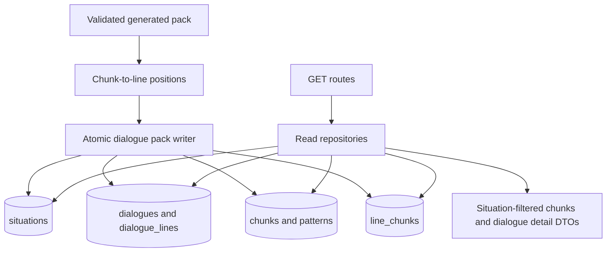

# Content Retrieval APIs - Plan

## Goal Capsule

- **Objective:** Replace the Situation, Chunk, and Dialogue read stubs with PostgreSQL-backed APIs that return the stored content graph.
- **Authority:** KEI-139 defines the required GET endpoints. `docs/database-architecture.md` defines the content graph. `backend/src/db/client.ts` owns runtime database construction.
- **Execution profile:** Backend read-path and generated-content association work with unit and disposable PostgreSQL integration coverage.
- **Stop conditions:** Do not return private, ownerless learner content across tenants. Stop if no safe interim visibility policy can be applied without authenticated ownership.
- **Tail ownership:** Implementation updates this plan's Definition of Done, moves KEI-139 to review, and records the PR URL on the Linear issue.

---

## Product Contract

### Summary

The APIs will retrieve situations, chunks, and dialogue details from the Phase 1 PostgreSQL graph.
Chunk filters will use the stored situation relationship and sentence-pattern difficulty.
Dialogue details will include ordered lines and the chunks associated with those lines.

### Problem Frame

The current GET routes return empty lists or `501` responses even though the generation writer persists situations, dialogues, lines, sentence patterns, and chunks.
The existing writer does not persist the relationships required to filter generated chunks by situation or return a dialogue's related chunks.

### Requirements

**Situation retrieval**

- R1. `GET /api/situations` returns a stable paginated list of readable situations from PostgreSQL.
- R2. `GET /api/situations/:id` returns the requested readable situation or a `404` error.

**Chunk retrieval**

- R3. `GET /api/chunks` returns a stable paginated list of readable chunks with their pattern and slot data.
- R4. The chunk list accepts `situationId` and filters through a persisted situation-to-chunk path.
- R5. The chunk list accepts `difficulty` and filters by `sentence_patterns.difficulty`, not the learner-specific FSRS difficulty.

**Dialogue retrieval**

- R6. `GET /api/dialogues/:id` returns a readable dialogue, its situation, and lines ordered by position.
- R7. Dialogue details return the related chunks and identify the chunks used by each line through persisted associations.

**API safety and compatibility**

- R8. Route query and path parameters reject invalid UUIDs and unsupported difficulty values with the existing `400` JSON error contract.
- R9. The new read routes construct database access lazily and preserve the existing `POST /api/dialogues/generate` behavior.
- R10. Before authentication ships, content reads use one explicit interim visibility policy that does not expose private rows to anonymous requests.

### Acceptance Examples

- AE1. Given persisted readable situations, `GET /api/situations` returns their list and `GET /api/situations/:id` returns one matching item.
- AE2. Given persisted chunks in two situations and two pattern difficulties, `GET /api/chunks?situationId=<id>&difficulty=easy` returns only chunks matching both filters.
- AE3. Given a persisted dialogue with four ordered lines and line-to-chunk links, `GET /api/dialogues/:id` returns the situation, lines in positions `0..3`, each line's chunk IDs, and the linked chunk records.
- AE4. Given an absent UUID, each detail endpoint returns the established `404` error body.
- AE5. Given malformed query parameters, the route returns `400` before querying the database.

### Scope Boundaries

- This plan implements only the GET routes named in KEI-139.
- This plan adds the generated-content associations required by those reads. It does not add unrelated write CRUD endpoints.
- This plan does not implement `GET /api/situations/:id/intents`, `GET /api/chunks/:id`, `GET /api/chunks/:id/patterns`, or the dialogue-list endpoint.
- This plan does not add authentication, user CRUD, search, embeddings, or changes to practice scheduling.

#### Deferred to Follow-Up Work

- Replace the interim anonymous visibility rule with authenticated owner-aware access control.
- Add a curated-content authoring or seed workflow for `intents` and `pattern_intents`.
- Add full-text or semantic content search after the basic retrieval contracts are stable.

---

## Planning Contract

### Key Technical Decisions

- KTD1. **Persist `line_chunks` from validated extraction associations.** Extend chunk extraction and the generated-pack contract to identify dialogue-line positions for each chunk, then have the existing atomic writer insert `line_chunks`. This uses the graph relationship defined in `docs/database-architecture.md` instead of unreliable text matching. Governs R4, R7.
- KTD2. **Use the persisted line-to-chunk path for both situation filtering and dialogue assembly.** Join `dialogues.situation_id → dialogue_lines → line_chunks → chunks`; this makes a generated pack queryable without adding a redundant chunk-level `situation_id`. Governs R4, R6, R7.
- KTD3. **Keep query parsing and HTTP translation in factory routes, and joins in repositories.** Route factories validate Zod inputs, lazily compose the database dependency, and translate not-found outcomes. Repositories return DTOs rather than leaking Drizzle rows. Governs R1–R9.
- KTD4. **Return only globally readable content until identity is available.** The implementation must define and apply one query predicate for anonymous reads, such as public visibility or a curated global row, consistently across situation, chunk, dialogue, and join queries. It must not treat `owner_id IS NULL` as implicit permission for generated learner content. Governs R10.
- KTD5. **Adopt cursor pagination using a deterministic UUID order.** Lists use the existing `{ items, nextCursor }` response shape, validate `limit` and UUID cursor values, fetch one extra row, and derive the next cursor from the final item. Governs R1, R3.

### Assumptions

- A generation-owned pack can add chunk-to-line associations without changing the public `POST /api/dialogues/generate` response shape.
- The chunk extraction prompt and schema can supply one or more referenced dialogue line positions for every extracted chunk.
- The owner will choose or approve the interim visibility predicate during implementation. The plan requires a fail-closed default if that policy cannot be made coherent with current generated content.

### High-Level Technical Design

### Sequencing

1. Add validated chunk-to-line associations to the generated pack and atomic writer.
2. Define read DTOs, query validation, visibility filtering, and repositories against the completed graph.
3. Compose the repositories into the Situation, Chunk, and Dialogue routes.
4. Prove public API behavior with mocked route tests and migrated PostgreSQL integration tests.

### Risks & Dependencies

- KEI-138 completed the pack writer but explicitly deferred `line_chunks`; this plan must close that persistence gap before it can meet R4 and R7.
- The current schema has ownership and visibility fields but no authentication middleware. Anonymous-read filtering needs one deliberate policy rather than accidental broad access.
- Generated chunk extraction currently has no line references. The plan changes a validated AI output contract, so fixtures and invalid-association cases need coverage.
- All production reads rely on `DATABASE_URL`; routes must retain the lazy database boundary so startup remains database-independent.

### Sources & Research

- `docs/database-architecture.md` defines `line_chunks` as the association between dialogue lines and chunks and defines pattern difficulty.
- `backend/src/db/dialogue-pack-writer.ts` writes generated packs atomically but does not insert `line_chunks`.
- `backend/src/dialogue-packs/generated-pack.ts` and `backend/src/ai/pipeline/schemas.ts` define the current validated extraction contract.
- `backend/src/routes/practice.ts` and `backend/src/db/practice-review-repository.ts` establish factory-route, repository, validation, and cursor-pagination conventions.
- `docs/plans/2026-08-09-002-feat-persist-generated-dialogue-pack-plan.md` records the prior writer boundary and its deferred line-link work.

---

## Implementation Units

### U1. Persist generated chunk-to-line associations

- **Goal:** Make every generated pack persist the relationships needed to retrieve its chunks by situation and dialogue line.
- **Requirements:** R4, R6, R7.
- **Dependencies:** None.
- **Files:** `backend/src/ai/pipeline/schemas.ts`, `backend/src/ai/pipeline/generate-dialogue.ts`, `backend/src/dialogue-packs/generated-pack.ts`, `backend/src/dialogue-packs/generated-pack.test.ts`, `backend/src/dialogue-packs/fixtures.ts`, `backend/src/db/dialogue-pack-writer.ts`, `backend/src/db/dialogue-pack-writer.test.ts`, `backend/src/db/dialogue-pack-writer.postgres.integration.test.ts`, `backend/src/db/dialogue-pack-writer.neon.integration.test.ts`.
- **Approach:**
  1. Extend the validated extraction output with dialogue-line positions for each extracted chunk.
  2. Preserve the validated associations in the neutral generated-pack DTO.
  3. Allocate and insert `line_chunks` rows inside each existing driver-specific atomic write path.
  4. Reject duplicate, missing, or out-of-range line references before persistence.
- **Patterns to follow:** `backend/src/ai/AGENTS.md` requires provider-agnostic Zod validation. `backend/src/db/dialogue-pack-writer.ts` owns atomic writes for PostgreSQL and Neon.
- **Test scenarios:**
  - A valid generated pack stores a link for every declared chunk-to-line association.
  - A chunk associated with multiple dialogue lines produces one unique `line_chunks` row per pair.
  - A duplicate pair, a missing line position, or an out-of-range position rejects before any database write.
  - A forced writer failure rolls back the new associations with the rest of the generated graph.
  - PostgreSQL and Neon writer paths both persist the expected associations.
- **Verification:** Writer tests prove association validation and atomic insertion for each supported database driver.

### U2. Define readable content repositories and API contracts

- **Goal:** Centralize content graph joins, DTO mapping, cursor pagination, filter semantics, and anonymous visibility filtering.
- **Requirements:** R1–R10.
- **Dependencies:** U1.
- **Files:** `backend/src/content/types.ts`, `backend/src/content/schemas.ts`, `backend/src/db/situation-repository.ts`, `backend/src/db/chunk-repository.ts`, `backend/src/db/dialogue-read-repository.ts`, `backend/src/db/content-read-repository.postgres.integration.test.ts`.
- **Approach:**
  1. Define route-facing DTOs that expose content fields without `ownerId` or raw visibility metadata.
  2. Define Zod schemas for UUID parameters, list limits, cursors, `situationId`, and `easy`/`medium`/`hard` pattern difficulty.
  3. Query situations and chunks with stable UUID cursors and one-extra-row pagination.
  4. Join dialogue, situation, ordered lines, `line_chunks`, chunks, patterns, slots, and variants into a deterministic detail DTO.
  5. Apply the chosen readable-content predicate consistently to all roots and nested joins.
- **Patterns to follow:** `backend/src/db/practice-review-repository.ts` for injected database repositories and cursor behavior. `backend/src/db/schema/content.ts` and `backend/src/db/schema/generation.ts` for graph ownership.
- **Test scenarios:**
  - Situation pagination returns the requested page and a cursor only when an additional readable row exists.
  - Chunk filtering with `situationId` and `difficulty` returns only rows matching both joins.
  - Difficulty maps to `sentence_patterns.difficulty` and does not consult `user_chunks`.
  - Dialogue assembly orders lines by position and deduplicates chunks linked by several lines.
  - Private or otherwise unreadable roots and nested content do not appear in anonymous results.
  - An absent readable situation or dialogue yields a repository not-found outcome.
- **Verification:** A migrated disposable database contains generated fixtures whose repository results match expected associations and filtering.

### U3. Replace Situation and Chunk route stubs

- **Goal:** Expose repository-backed Situation detail/list and Chunk list APIs through validated Hono routes.
- **Requirements:** R1–R5, R8–R10.
- **Dependencies:** U2.
- **Files:** `backend/src/routes/situations.ts`, `backend/src/routes/situations.test.ts`, `backend/src/routes/chunks.ts`, `backend/src/routes/chunks.test.ts`.
- **Approach:**
  1. Convert both route modules to injectable factories matching `createPracticeRouter`.
  2. Validate list and path inputs before resolving the lazy database dependency.
  3. Map repository not-found results to the existing `HTTPException` error contract.
  4. Retain the unrelated nested and detail stubs outside this issue's scope.
- **Patterns to follow:** `backend/src/routes/practice.ts` for dependency injection and validation. `backend/src/lib/errors.ts` for error response shape.
- **Test scenarios:**
  - A valid situation list returns the repository page unchanged.
  - A valid situation ID returns its detail DTO and a missing ID returns `404`.
  - A valid chunk filter forwards the normalized situation ID, difficulty, limit, and cursor to the repository.
  - Invalid UUID, limit, cursor, or difficulty values return `400` without calling the repository.
  - An empty readable result returns `{ items: [], nextCursor: null }`.
- **Verification:** Unit tests prove HTTP status, JSON contract, dependency invocation, and no eager database access on invalid input.

### U4. Replace the Dialogue detail stub

- **Goal:** Return one stored dialogue with its situation, ordered lines, and related chunks without changing generation behavior.
- **Requirements:** R6–R10.
- **Dependencies:** U1, U2.
- **Files:** `backend/src/routes/dialogues.ts`, `backend/src/routes/dialogues.test.ts`, `backend/src/routes/dialogues.integration.test.ts`.
- **Approach:**
  1. Add a read-repository dependency to the existing dialogue factory.
  2. Validate the dialogue UUID and resolve the repository only for the GET detail route.
  3. Return the assembled DTO, including per-line chunk IDs and top-level deduplicated chunks.
  4. Keep `POST /generate` request validation, AI composition, persistence configuration, status code, and response shape intact.
- **Patterns to follow:** `backend/src/routes/dialogues.ts` for the current factory and `backend/src/routes/dialogues.integration.test.ts` for a migrated generated-pack fixture.
- **Test scenarios:**
  - A readable dialogue returns its matching situation, line positions in ascending order, per-line chunk IDs, and linked chunk records.
  - A missing or unreadable dialogue returns `404`.
  - An invalid UUID returns `400` without constructing a repository or database client.
  - Existing generate tests retain the same `201` response and persistence projection behavior.
  - An integration request reads back a pack generated and persisted through the route using its returned dialogue ID.
- **Verification:** Route and integration tests prove the public detail contract and preserve generator compatibility.

### U5. Document the implemented retrieval boundary

- **Goal:** Keep backend guidance accurate after the stubs become live database APIs.
- **Requirements:** R9, R10.
- **Dependencies:** U3, U4.
- **Files:** `backend/AGENTS.md`, `backend/README.md`, `docs/plans/2026-08-10-001-feat-content-retrieval-apis-plan.md`.
- **Approach:**
  1. Replace stale stub guidance with the completed read-route contract and its database requirement.
  2. Document the interim visibility rule and the dependency on future authenticated ownership.
  3. Record verification evidence and mark this plan's Definition of Done only after the required checks pass.
- **Test expectation:** none -- documentation-only unit after route behavior is verified by U1–U4.
- **Verification:** Documentation matches the released route behavior and does not expose secrets.

---

## Verification Contract

| Gate | Applies to | Done signal |
|---|---|---|
| Type check | U1–U5 | `npm run typecheck` passes from `backend/`. |
| Unit tests | U1–U4 | `npm run test` passes with writer, repository, and route coverage. |
| Database integration | U1, U2, U4 | `npm run test:db` passes with `TEST_DATABASE_URL` targeting a disposable pgvector database. |
| Filter contract | U2–U3 | Combined `situationId` and `difficulty` filters return only the expected readable chunks. |
| Dialogue contract | U1, U2, U4 | A persisted dialogue round-trips with ordered lines and its line-linked chunks. |
| Visibility review | U2–U5 | Anonymous routes apply one documented restrictive predicate and do not return private content. |
| Regression | U4 | Existing `POST /api/dialogues/generate` unit and integration tests retain their established status and response contracts. |

---

## Definition of Done

- [ ] U1 persists validated line-to-chunk associations atomically for generated packs.
- [ ] U2 provides validated, visibility-aware content read repositories.
- [ ] U3 replaces the Situation list/detail and Chunk list stubs required by KEI-139.
- [ ] U4 replaces the Dialogue detail stub with situation, ordered lines, and related chunks.
- [ ] U5 updates backend documentation and records verification evidence.
- [ ] `npm run typecheck` and `npm run test` pass from `backend/`.
- [ ] `npm run test:db` passes against a disposable `TEST_DATABASE_URL`.
- [ ] Invalid parameters return `400`, absent readable details return `404`, and no private content is exposed anonymously.
- [ ] No unrelated CRUD, authentication, or practice behavior changes remain in the diff.
