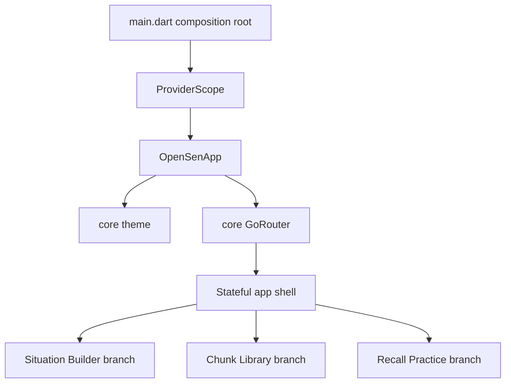

# Mobile App Shell - Plan

## Goal Capsule

- **Objective:** Replace the Flutter starter Counter surface with an OpenSen application shell that has declarative routes, Riverpod at the composition root, and persistent primary navigation.
- **Authority:** KEI-142 defines the acceptance criteria. `docs/product-strategy.md` defines the Phase 1 learning loop and MVP surfaces.
- **Execution profile:** Flutter foundation work. Prefer widget tests and static analysis before a device smoke test.
- **Stop conditions:** Stop if the selected packages do not resolve for the repository's Dart SDK constraint, or if the existing repository state produces a compile failure unrelated to this shell.
- **Tail ownership:** Implementation updates this plan's Definition of Done and moves KEI-142 to In Review with the resulting PR link.

---

## Product Contract

### Summary

The mobile client will open into an OpenSen shell with navigation for the first Phase 1 learning surfaces.
The shell establishes extension seams without implementing situation generation, API access, chunk data, or FSRS review behavior.

### Problem Frame

`mobile/lib/main.dart` and `mobile/test/widget_test.dart` are still the standard Flutter Counter template.
The package has no routing or application state boundary, so upcoming mobile features cannot share a stable app composition and navigation surface.

### Requirements

**Application foundation**

- R1. `mobile/lib/main.dart` compiles and starts the OpenSen application without Counter demo widgets, demo copy, or an increment action.
- R2. The client separates cross-cutting application concerns under `mobile/lib/core/` from product capabilities under `mobile/lib/features/`.
- R3. The application uses `go_router` with `MaterialApp.router` as its primary navigation entry point.
- R4. The application initializes Riverpod once above the application widget so future features can access state through a consistent dependency boundary.

**Shell experience**

- R5. The initial route presents an OpenSen-branded shell with primary navigation to Situation Builder, Chunk Library, and Recall Practice.
- R6. Selecting a primary destination updates the route and selected navigation state while retaining the shared shell chrome.
- R7. Each destination has an intentional, accessible placeholder state that names its capability without implying unavailable API or practice functionality.

### Acceptance Examples

- AE1. Given a fresh launch, the learner sees the OpenSen shell and a selected primary destination instead of Counter demo content.
- AE2. Given the learner selects each primary destination, the matching route and selected navigation destination are shown.
- AE3. Given a widget test pumps the application, it can provide Riverpod overrides and render the router without a device or backend.

### Scope Boundaries

- This plan creates the mobile application foundation only. It does not call backend APIs, add authentication, persist local data, generate dialogues, load chunks, or submit FSRS reviews.
- This plan does not add onboarding, deep-link platform association files, adaptive desktop navigation, analytics, localization, or a design system beyond the app theme required by the shell.
- Existing Flutter platform directories remain unchanged unless Flutter package resolution requires generated metadata updates.

#### Deferred to Follow-Up Work

- KEI-143 owns the HTTP client and API DTOs.
- KEI-144 owns the Situation Builder form and generated dialogue presentation.
- KEI-145 owns Recall Practice behavior and FSRS review submission.

---

## Planning Contract

### Product Contract Preservation

No upstream product-contract artifact exists. This plan derives its product contract from KEI-142 and the established MVP surfaces in `docs/product-strategy.md`.

### Key Technical Decisions

- KTD1. **Adopt `flutter_riverpod` for application state.** It satisfies the issue's Provider/Riverpod requirement and gives future feature repositories and view state a testable dependency seam without coupling `main.dart` to feature state.
- KTD2. **Model the shell with `StatefulShellRoute.indexedStack`.** Each primary destination receives a route branch and keeps its navigation subtree mounted when tabs switch. This avoids replacing the route architecture when feature screens become stateful.
- KTD3. **Keep routing and theming in `core`, and keep route screens inside their owning feature.** `core` exposes the shared app infrastructure; `features` owns visible capability placeholders and later feature behavior.
- KTD4. **Use product-capability labels, not generic “Home” content.** The first shell must orient learners around building a situation, finding chunks, and practicing recall while withholding unavailable actions.

### Assumptions

- The intended state-management choice is Riverpod rather than the `provider` package because the issue permits either and no mobile state-management convention exists yet.
- The first shell destinations represent the Phase 1 capabilities Situation Builder, Chunk Library, and Recall Practice. Their labels and placeholder content are navigational scaffolding, not completed product features.
- The current `main.dart` may not reproduce a compile error under its declared Dart `^3.12.0` constraint: its `.fromSeed` expression uses Dart dot shorthand. Implementation must first capture the actual analyzer result and fix only reproducible failures.
- The Cloud environment does not currently expose a `flutter` executable. Verification must run where a compatible Flutter SDK is installed.

### High-Level Technical Design



### Sequencing

1. Add the supported routing and state-management dependencies, then define the app composition and theme boundary.
2. Establish the feature-first route branches and shell UI.
3. Replace Counter coverage with application and navigation widget coverage.
4. Run static analysis, tests, and a platform smoke test using a compatible Flutter SDK.

### Risks & Dependencies

- `mobile/pubspec.yaml` currently declares only the Flutter SDK and `cupertino_icons`; package resolution must be verified against the declared Dart SDK before source migration.
- The repository contains no prior Flutter architecture or router examples, so the implementation should avoid introducing API, data, or domain abstractions before the feature issues that own them.
- A current `flutter` executable was not available during planning. The implementation environment must supply Flutter before it can prove compilation and widget tests.

### Sources & Research

- `mobile/lib/main.dart` and `mobile/test/widget_test.dart` show the unmodified Counter starter surface and its only test.
- `mobile/pubspec.yaml` declares Dart `^3.12.0` and no current routing or state-management dependency.
- `docs/product-strategy.md` defines the Phase 1 loop and the Situation Builder, chunk, and Recall Practice MVP surfaces.
- [go_router documentation](https://pub.dev/packages/go_router) documents `ShellRoute` and `StatefulShellRoute` for a persistent navigation shell.
- [flutter_riverpod documentation](https://pub.dev/packages/flutter_riverpod) documents `ProviderScope` as the root Riverpod container.
- [Flutter widget-testing documentation](https://docs.flutter.dev/cookbook/testing/widget/introduction) documents widget-level rendering and interaction coverage.

---

## Output Structure

```text
mobile/lib/
├── main.dart
├── app.dart
├── core/
│   ├── routing/
│   │   └── app_router.dart
│   └── theme/
│       └── app_theme.dart
└── features/
    ├── shell/presentation/
    │   └── app_shell.dart
    ├── situations/presentation/
    │   └── situation_builder_placeholder.dart
    ├── chunks/presentation/
    │   └── chunk_library_placeholder.dart
    └── practice/presentation/
        └── recall_practice_placeholder.dart
```

---

## Implementation Units

### U1. Establish the mobile composition and infrastructure boundaries

- **Goal:** Replace the starter entry point with a minimal OpenSen application composition root.
- **Requirements:** R1, R2, R3, R4.
- **Dependencies:** None.
- **Files:** `mobile/pubspec.yaml`, `mobile/lib/main.dart`, `mobile/lib/app.dart`, `mobile/lib/core/routing/app_router.dart`, `mobile/lib/core/theme/app_theme.dart`, `mobile/test/app_test.dart`.
- **Approach:**
  1. Add current compatible `go_router` and `flutter_riverpod` dependencies through the package manager.
  2. Put `ProviderScope` at the process entry point and make the application widget own `MaterialApp.router`.
  3. Expose one configured router and one OpenSen Material theme from `core`.
  4. Remove Counter-specific classes and copy from `main.dart`.
- **Patterns to follow:** Keep framework composition at `main.dart` and `app.dart`. Do not introduce repositories, HTTP clients, or feature state before their owning issues.
- **Test scenarios:**
  - Pumping the application with a `ProviderScope` renders `MaterialApp.router`.
  - The initial render contains OpenSen application identity and no Counter demo text or increment control.
  - A test can create the app with a Riverpod override without changing production composition.
- **Verification:** Static analysis resolves all imports and the application root renders in a widget test.

### U2. Build feature-owned route branches and the persistent navigation shell

- **Goal:** Render a navigable OpenSen shell for the three Phase 1 mobile capabilities.
- **Requirements:** R2, R3, R5, R6, R7.
- **Dependencies:** U1.
- **Files:** `mobile/lib/core/routing/app_router.dart`, `mobile/lib/features/shell/presentation/app_shell.dart`, `mobile/lib/features/situations/presentation/situation_builder_placeholder.dart`, `mobile/lib/features/chunks/presentation/chunk_library_placeholder.dart`, `mobile/lib/features/practice/presentation/recall_practice_placeholder.dart`, `mobile/test/app_shell_test.dart`, `mobile/test/app_router_test.dart`.
- **Approach:**
  1. Define stable root paths for Situation Builder, Chunk Library, and Recall Practice in the router.
  2. Use the persistent shell to translate route branch selection into Material navigation and branch switching.
  3. Give each feature-owned destination a lightweight empty or coming-soon state with clear capability naming.
  4. Keep all API calls, mutable learning data, and final feature interactions out of this unit.
- **Patterns to follow:** Use `StatefulShellRoute.indexedStack` to preserve branch state and `NavigationDestination` semantics for the primary navigation control.
- **Test scenarios:**
  - Covers AE1. A fresh app launch selects the Situation Builder branch and displays shell navigation.
  - Covers AE2. Tapping Chunk Library changes the visible destination and the active route state.
  - Covers AE2. Tapping Recall Practice changes the visible destination and the active route state.
  - Directly opening each configured primary path renders its feature-owned placeholder inside the shell.
  - Navigation labels and icons remain discoverable by Flutter finder semantics.
- **Verification:** Router coverage proves all primary branches resolve and shell coverage proves route-driven tab selection.

### U3. Replace starter coverage and prove the application baseline

- **Goal:** Turn the starter Counter test into maintainable app-shell regression coverage and prove the mobile baseline.
- **Requirements:** R1, R3, R4, R5, R6, R7.
- **Dependencies:** U1, U2.
- **Files:** `mobile/test/widget_test.dart`, `mobile/test/app_test.dart`, `mobile/test/app_shell_test.dart`, `mobile/test/app_router_test.dart`.
- **Approach:**
  1. Delete or replace the Counter increment test so no starter-specific assertion remains.
  2. Consolidate tests around app launch, root dependency setup, direct route resolution, and navigation selection.
  3. Use semantic finders and visible product labels rather than private implementation details.
- **Execution note:** Run analyzer and widget tests before a device or emulator smoke test; the Cloud environment lacks Flutter, so execute these gates in a Flutter-enabled environment.
- **Patterns to follow:** The existing package uses `flutter_test`; maintain the standard Flutter widget-test structure rather than adding a separate test framework.
- **Test scenarios:**
  - The test suite has no assertion for the Counter value, increment button, or Flutter Demo title.
  - Pumping every primary route completes without an exception.
  - Switching tabs does not throw and retains the navigation shell.
  - The app compiles and the full widget suite passes with the resolved package versions.
- **Verification:** Static analysis is clean, widget tests pass, and a debug launch reaches the selected initial shell destination.

---

## Verification Contract

| Gate | Applies to | Done signal |
|---|---|---|
| Dependency resolution | U1 | `flutter pub get` resolves the selected packages under the package SDK constraint. |
| Static analysis | U1–U3 | `flutter analyze` from `mobile/` reports no warnings or errors. |
| Widget tests | U1–U3 | `flutter test` from `mobile/` passes app, router, and shell coverage with no Counter test remaining. |
| Debug smoke | U1–U3 | A debug launch on one supported Flutter target opens the OpenSen shell and switches all primary destinations. |
| Scope audit | U2–U3 | No HTTP client, data persistence, dialogue generation, chunk retrieval, or FSRS submission enters the diff. |

---

## Definition of Done

- [ ] U1 removes the Counter starter composition and establishes router, theme, and Riverpod application boundaries.
- [ ] U2 provides route-driven OpenSen primary navigation and feature-owned placeholders.
- [ ] U3 replaces Counter coverage with application and shell navigation tests.
- [ ] `flutter analyze` completes with no warnings or errors from `mobile/`.
- [ ] `flutter test` completes successfully from `mobile/`.
- [ ] A debug smoke test reaches the OpenSen shell and each primary destination.
- [ ] The final diff contains no implementation of deferred API, generation, chunk-data, or FSRS behavior.
