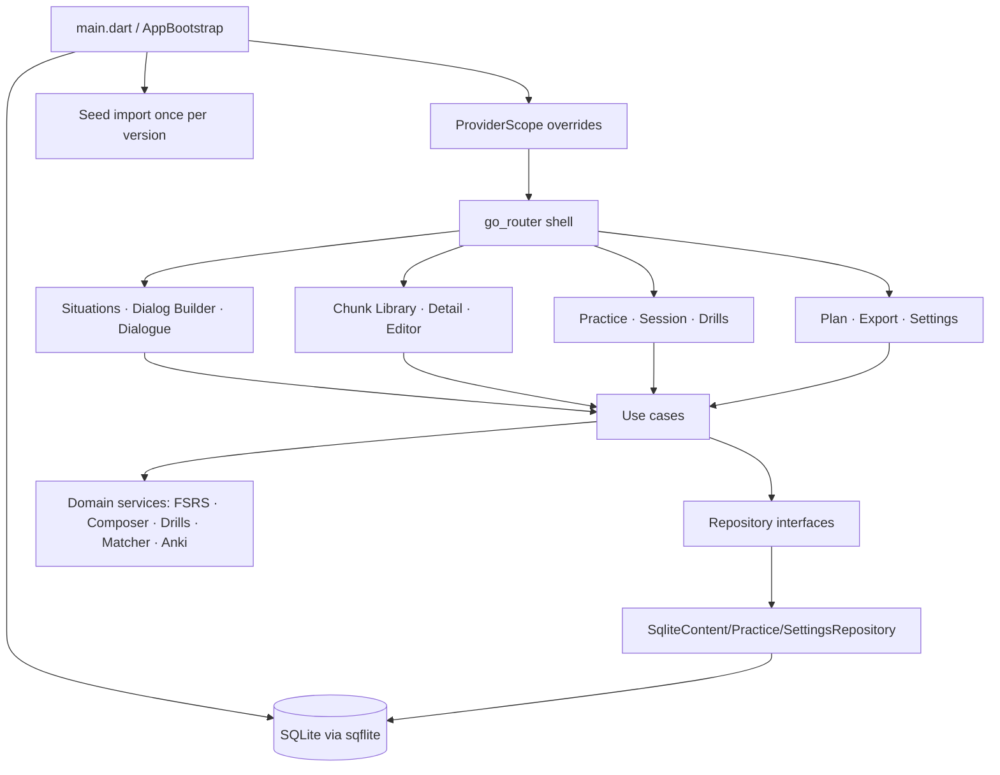

# Mobile Offline App v1 - Plan

## Goal Capsule

- **Objective:** Ship the first complete, fully offline OpenSen mobile app in Flutter: every product surface in `docs/features.md` works on-device with bundled content, local SQLite persistence and FSRS scheduling — no backend, no network.
- **Authority:** `docs/product-strategy.md` (core loop, MVP surfaces, non-goals), `docs/features.md` (surface names), `docs/database-architecture.md` (schema shape, adapted for one local learner). Owner delegated all v1 decisions to the agent.
- **Execution profile:** Flutter/Dart, Clean Architecture per root `AGENTS.md`. The agent environment had no Flutter SDK; verification runs through `.github/workflows/mobile-ci.yml` and the owner's local `flutter analyze` / `flutter test`.
- **Stop conditions:** Stop if a chosen package cannot resolve against the Dart `^3.12.0` constraint, or if CI reveals a Flutter API mismatch that needs a product decision.
- **Tail ownership:** PR to `main`; Linear issues created and linked once Linear is authenticated; Definition of Done ticked from CI evidence.

---

## Product Contract

### Summary

A learner opens OpenSen, picks the conversation they need, personalises a dialogue with their own details, and practises its chunks (listen–repeat, say-from-meaning, fill the gap, swap the slot) on an FSRS schedule — entirely offline. They can grow their own sentence graph (custom frames with slots) and export everything to Anki.

### Problem Frame

`mobile/` was the Flutter Counter template. The product docs describe an AI-backed loop, but the owner wants a working offline app first. Offline changes one thing: **Dialog Builder cannot call a model**, so personalisation must come from the sentence graph itself — template dialogues whose lines are frames with slots, filled from the learner's answers. That is the chunking method applied to generation, and it keeps every other surface identical to the strategy.

### Requirements

**Foundation**
- R1. `mobile/` starts into an OpenSen shell (go_router `StatefulShellRoute`, Riverpod at the root) with destinations Situations · Library · Practice · Plan.
- R2. Domain (`lib/domain`) is pure Dart: entities, repository interfaces, services (FSRS, composer, drills, matcher, Anki formatter) and use cases import no Flutter, no plugins.
- R3. Persistence is local SQLite (`sqflite` on mobile, `sqflite_common_ffi` on desktop/tests) with a schema adapted from `docs/database-architecture.md` for one learner; timestamps are ISO-8601 UTC.
- R4. Bundled seed content (`assets/seed/content.json`) is imported once per seed version and never overwrites rows the learner may have practised.

**Surfaces**
- R5. **Situation Coverage:** ≥ 9 situation templates across Travel · Work · Study · Daily · Social, each with roles, goal, tone, level, ≥ 3 drillable frames and a template dialogue.
- R6. **Dialog Builder (offline):** form with role, other speaker, goal, tone, level, and one question per personalisable slot; generates a personal situation + dialogue + chunk instances instantly; deduplicates chunk text against the library.
- R7. **Chunk Library:** search by text/meaning, filter by register / mine / in-plan, chunk detail with frame, variants, siblings, practice state; edit meaning; create custom sentences where `{slot}` turns the sentence into a frame with variants.
- R8. **Substitution Drills:** per frame, two worked variants → blanked frame; recognise (pick) then produce (type); unknown fills can be kept as personal variants.
- R9. **Recall Practice:** session of due chunks with the four modes (listen & repeat, L1→L2, cloze, slot swap), production before reveal, optional typed answer with match score, grading Forgot/Hard/Good/Easy showing the interval each grade schedules; same-session re-queue for learning steps.
- R10. **Practice Plan:** FSRS per chunk (learning steps 1m/10m, relearning 10m, configurable desired retention, daily-new limit, session size); dashboard with due now, next 7 days, status breakdown, reviewed today, streak.
- R11. **Anki Export:** tab-separated import file (`#separator`, `#html`, `#tags column`) with meaning on the front, chunk + frame + fills on the back, situation/register/level tags; shared via the platform share sheet.
- R12. **Onboarding:** two questions (goal → conversation you need soon) with keyword matching to a situation template; skippable; no decks, folders or tags up front.
- R13. **Settings:** daily new limit, session size, desired retention, TTS on/off + rate, theme, reset progress, redo onboarding.

**Quality**
- R14. Unit tests for FSRS, slot templates, composer, drills, practice items/session, matcher, Anki formatter, seed authoring rules; SQLite repository tests via `sqflite_common_ffi`; widget tests for shell, onboarding, build→practice→grade and drill flows.
- R15. GitHub Actions workflow runs `flutter analyze`, `flutter test`, builds a debug-signed release APK; optional iOS no-codesign build.

### Acceptance Examples

- AE1. Fresh install → onboarding → "Meeting my professor" → tap suggestion → builder pre-filled with roles → answer "generative AI" → dialogue renders "I'm particularly interested in generative AI." → "Practice these chunks now" → first item shows within one second.
- AE2. Grade a new chunk Good → it returns in 10 minutes inside the same session; grade Good again → status Review with a day-scale interval; Forgot on a review chunk → Relearning, lapses +1.
- AE3. Library → "My sentence" → `I'm allergic to {thing}` with fills `cats, pollen` → saved as a frame; drill offers the two fills; typing `dust` offers "Keep it as my own fill".
- AE4. Plan → Export to Anki → file with `#separator:tab` header, one row per enrolled chunk, tags `opensen::meeting_a_professor`.

### Scope Boundaries

- No network, auth, backend calls, AI generation, speech-to-text, pronunciation scoring, audio assets, packs/entitlements, sync.
- Meanings are English glosses; L1 (Vietnamese) translations are a content follow-up, editable per chunk today.
- Android application id stays `com.example.opensen` (rename is a platform follow-up).
- `.apkg` export is out of scope; the text import format is what Anki documents for File → Import.

#### Deferred to Follow-Up Work

- Speech-to-text match rate (`speech_to_text`) behind a `SpeechRecognizer` seam.
- Backend sync of `user_chunks` / `review_history` (client ids and UTC timestamps are already sync-ready).
- Seed content v2: Vietnamese glosses, more situations, register variants per frame.
- Swap the hand-written FSRS-5 module for the `fsrs` pub package behind `FsrsScheduler` if parameter optimisation is wanted.

---

## Planning Contract

### Key Technical Decisions

- KTD1. **Offline Dialog Builder = slot substitution over template dialogues.** Template lines carry `{slot}` markers; the learner's answers fill them and chunk instances are rendered from the pattern (`DialogueComposer`). Identical text reuses existing chunks. This is the "personal sentence graph" without a model.
- KTD2. **FSRS-5 implemented in pure Dart** (`domain/services/fsrs/`) with the published default weights, learning/relearning steps like py-fsrs, intervals derived from stability (never stored). Chosen over the `fsrs` pub package to avoid an unverifiable API surface while the agent cannot run `pub get`; the scheduler is behind one class so it can be swapped.
- KTD3. **sqflite with hand-written SQL, no code generation.** Drift/Isar need `build_runner`, which the agent could not run; repositories import `sqflite_common` only, so they stay plugin-free and test on the host with `sqflite_common_ffi`.
- KTD4. **Riverpod without codegen and without family Notifiers.** Data providers are `Provider` / `FutureProvider(.family)`; settings is a `Notifier`; transient session state (drill, practice) lives in domain session classes held by `ConsumerStatefulWidget`s. This keeps the code valid on Riverpod 2.x and 3.x.
- KTD5. **Settings in the `meta` table**, not `shared_preferences` — one fewer plugin; bootstrap loads them before the first frame and injects them via `initialSettingsProvider`.
- KTD6. **Explicit enrolment.** A chunk enters the plan only when the learner adds it (dialogue "Practice now", situation "Add chunks", chunk detail). `user_chunks` rows are the plan; `next_review IS NULL OR <= now` is due.
- KTD7. **Seed authoring rules are executable** (`SeedBundle.validate()` + test): slots match templates, template chunk text equals the pattern rendered with first variants, every `{slot}` in a dialogue line is fillable by a linked chunk's pattern, prompts reference slots of the situation's patterns.

### Assumptions

- Latest stable Flutter (Dart ≥ 3.12) on the owner's machine and in CI; `DropdownButtonFormField.initialValue`, `MediaQuery.sizeOf`, Material 3 colour roles are available.
- Package ranges: `flutter_riverpod ^3.0.0`, `go_router ^16.0.0`, `sqflite ^2.4.1`, `sqflite_common ^2.5.4`, `sqflite_common_ffi ^2.3.4`, `flutter_tts ^4.2.0`, `share_plus ^11.0.0`, `path_provider ^2.1.5`, `uuid ^4.5.1`. `pubspec.lock` is regenerated by `flutter pub get` and should be committed afterwards.
- `flutter test` on Windows finds `sqlite3.dll` through the Dart SDK; Ubuntu CI installs `libsqlite3-dev`.

### High-Level Technical Design



### Sequencing

1. Dependencies, domain entities, services (FSRS, slot templates, composer, drills, matcher, Anki), repository interfaces, use cases.
2. SQLite schema, seed parser/importer, repository implementations, settings.
3. Composition root (providers, bootstrap, router, theme, platform seams), shell and feature screens.
4. Seed content (9 situations) validated by script and test.
5. Tests (domain, data, widget), CI workflow, docs/DOX.

### Risks & Dependencies

- The agent could not run `flutter analyze` / `flutter test`; first CI run is the compile gate. Lint infos are non-fatal in CI (`--no-fatal-infos`); `dart fix --apply` clears them.
- Riverpod 3 / go_router 16 API drift: mitigated by using only the stable core APIs (see KTD4).
- `share_plus` 11 `SharePlus.instance.share(ShareParams(...))` is isolated in `ShareExportSink`.
- Desktop (Windows/Linux) runs need a system SQLite library; mobile targets need nothing extra.

---

## Output Structure

```text
mobile/
├── assets/seed/content.json           # curated graph, version 1
├── lib/
│   ├── main.dart · app.dart
│   ├── core/  bootstrap · di/providers · routing · theme · platform (tts, share) · util (uuid)
│   ├── domain/ entities · repositories · services (fsrs/, composer, drills, sessions, matcher, anki) · usecases
│   ├── data/   db/app_database · seed/ (parser, importer) · repositories/ (sqlite content/practice/settings)
│   └── features/ shell · onboarding · situations · chunks · drills · practice · plan · export · settings · shared
└── test/ domain/ · data/ · features/ · helpers/fakes.dart
.github/workflows/mobile-ci.yml
```

---

## Implementation Units

### U1. Domain core (entities, FSRS, services, use cases)
- **Requirements:** R2, R9, R10, R6, R8, R11.
- **Files:** `lib/domain/**`.
- **Verification:** `test/domain/*_test.dart` (FSRS monotonicity and state machine, slot templates, composer, drills, items/session, matcher, Anki formatter, situation matcher).

### U2. Data layer and seed content
- **Requirements:** R3, R4, R5.
- **Files:** `lib/data/**`, `assets/seed/content.json`, `assets/seed/AGENTS.md`.
- **Verification:** `test/data/seed_content_test.dart` (authoring rules), `test/data/sqlite_repositories_test.dart` (round trips, build dialogue on SQLite, reviews, stats, export, settings).

### U3. Composition root, routing, shell, features
- **Requirements:** R1, R6–R13.
- **Files:** `lib/main.dart`, `lib/app.dart`, `lib/core/**`, `lib/features/**`.
- **Verification:** `test/features/app_test.dart` (shell navigation, onboarding, build → practice → grade, drill).

### U4. CI and docs
- **Requirements:** R14, R15.
- **Files:** `.github/workflows/mobile-ci.yml`, `mobile/AGENTS.md`, `mobile/assets/seed/AGENTS.md`, root `AGENTS.md`, `README.md`, this plan.

---

## Verification Contract

| Gate | Applies to | Done signal |
|---|---|---|
| Dependency resolution | U1–U3 | `flutter pub get` resolves under Dart `^3.12.0`. |
| Static analysis | U1–U3 | `flutter analyze` reports no errors or warnings (CI: `--no-fatal-infos`). |
| Unit + repository tests | U1, U2 | `flutter test test/domain test/data` passes (SQLite via `sqflite_common_ffi`). |
| Widget tests | U3 | `flutter test test/features` passes. |
| Android build | U3 | CI `flutter build apk --release` uploads `app-release.apk`. |
| Manual smoke | U3 | AE1–AE4 on a device or emulator. |

---

## Linear issues to create

Linear MCP requires interactive authentication in the Cursor desktop IDE and could not be reached from the agent session. Create these in project **OpenSen** (workspace `keios`) — titles/descriptions are Vietnamese per `LOOP.mdc` — then replace `linear_issues: []` above and add the PR URL to each issue.

| # | Tiêu đề | Mô tả ngắn | Trạng thái đề xuất |
|---|---|---|---|
| 1 | [mobile] Nền tảng app offline: domain thuần Dart, FSRS-5, use case | `lib/domain/**`: entity, repository interface, FSRS scheduler (learning steps), composer hội thoại theo slot, drill generator, matcher, Anki formatter, use case. Test `test/domain`. | In Review |
| 2 | [mobile] Lớp dữ liệu SQLite + nội dung seed 9 tình huống | `lib/data/**`, `assets/seed/content.json`: schema sqflite, importer theo phiên bản seed, repository content/practice/settings, quy tắc biên soạn seed có test. | In Review |
| 3 | [mobile] Shell + màn hình: Situations, Dialog Builder offline, Library, Drills, Recall Practice, Plan, Export, Settings, Onboarding | `lib/core/**`, `lib/features/**`: go_router shell 4 tab, Riverpod composition root, TTS/share seam, toàn bộ UI v1. Widget test `test/features`. | In Review |
| 4 | [mobile] CI GitHub Actions: analyze, test, build APK | `.github/workflows/mobile-ci.yml`; chạy khi có thay đổi `mobile/**`; iOS build tùy chọn. | In Review |
| 5 | [mobile] Theo dõi sau CI lần đầu: sửa lỗi phân tích/test nếu có, commit `pubspec.lock` | Chạy `flutter pub get`, `flutter analyze`, `flutter test` tại máy owner; `dart fix --apply` cho lint info; smoke AE1–AE4 trên thiết bị. | Todo |
| 6 | [mobile] Follow-up v1.1: speech-to-text cho Recall Practice | Seam `SpeechRecognizer`, plugin `speech_to_text`, match score từ giọng nói. | Backlog |
| 7 | [content] Seed v2: nghĩa tiếng Việt + thêm tình huống | Thêm `meaning_vi`, mở rộng 9 → 15 tình huống, biến thể theo register. | Backlog |

---

## Definition of Done

- [x] U1 domain core written with unit tests.
- [x] U2 SQLite data layer, seed importer and validated seed content (9 situations, 41 frames, 47 chunks, 9 dialogues).
- [x] U3 composition root, router, shell and all v1 screens.
- [x] U4 CI workflow and DOX docs updated.
- [x] `flutter analyze` completes with no errors or warnings from `mobile/` — CI run [35512287961](https://github.com/KeiosStarqua/opensen/actions/runs/35512287961) on Flutter 3.47.5 stable (`dart format` advisory step lists 57 files to reformat; run `dart format .` in `mobile/`).
- [x] `flutter test` completes successfully from `mobile/` — 73 tests passed in the same run.
- [x] CI builds `app-release.apk` — artifact `opensen-android-apk` (27.6 MB) on the same run.
- [ ] Linear issues created, linked to the PR, `linear_issues:` filled in above.
- [ ] Manual smoke AE1–AE4 on a device.

PR: [KeiosStarqua/opensen#17](https://github.com/KeiosStarqua/opensen/pull/17)
