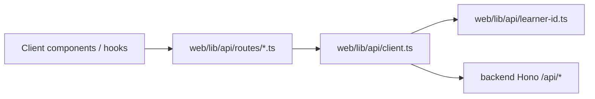

# Web API client và danh tính người học tạm (KEI-729) — Plan

## Goal Capsule

- **Objective:** Ship a shared HTTP client in `web/` so every app surface calls `backend/` through one module, with a stable temporary learner identity (`X-User-Id` UUID in `localStorage`) until real auth exists.
- **Authority:** Linear [KEI-729](https://linear.app/keios/issue/KEI-729/web-client-api-va-danh-tinh-nguoi-hoc-tam) (acceptance criteria), epic parent [KEI-727](https://linear.app/keios/issue/KEI-727), `web/AGENTS.md`, `backend/AGENTS.md`.
- **Execution profile:** Next.js 16 App Router, TypeScript, `@/*` imports. Client code runs in the browser (`"use client"` consumers or hooks); no FSRS, dialogue composer, or AI pipeline in `web/`.
- **Stop conditions:** Stop if backend error JSON shape changes without a coordinated backend PR; stop if product requires auth before this lands (out of scope for KEI-729).
- **Tail ownership:** PR to `main`; Linear KEI-729 → In Review after `ce-work`; Definition of Done ticked from tests + lint/build.
- **Dependency note:** [KEI-728](https://linear.app/keios/issue/KEI-728) owns the authenticated app shell and route groups; this issue only delivers the API layer and a minimal error/retry contract that feature issues (KEI-730–739) import. Do not implement shell navigation in this plan.

---

## Product Contract

### Summary

Web features need the same Hono API the mobile client will eventually use. Practice routes already require a UUID `X-User-Id` header (`backend/src/lib/user-context.ts`). The web client must attach that header on every mutating and practice-related call, survive reloads, and surface HTTP and network failures without crashing React trees.

### Problem Frame

`web/` today has landing/onboarding UI only (`components/`, `app/(marketing)/`, `app/(app)/onboarding/`) and **no** shared `fetch` wrapper or env-documented API base URL. Upcoming web surfaces (Today, Situations, Dialog Builder, Practice, etc.) would otherwise duplicate headers, error parsing, and base URL logic — violating acceptance criterion “không `fetch` rải rác”.

### Requirements

**Client & configuration**

- R1. A single module tree under `web/lib/api/` exposes typed helpers for existing route prefixes: `/api/situations`, `/api/chunks`, `/api/dialogues`, `/api/practice`, `/api/export` (paths mirror `backend/src/index.ts`).
- R2. Base URL comes from `NEXT_PUBLIC_OPENSEN_API_URL` (document in `web/README.md` and `web/.env.example`; never commit secrets). Default for local dev: `http://localhost:3000` when backend runs via `npx vercel dev` in `backend/`, or the deployed API URL in preview/production.
- R3. All JSON requests set `Content-Type: application/json` when a body is present; CORS is satisfied by backend `CORS_ORIGINS` including the web origin.

**Temporary learner identity**

- R4. On first use in the browser, generate a UUID v4 and persist under a stable key (e.g. `opensen:learner-id`) in `localStorage`; reuse on subsequent visits and reloads.
- R5. Every request through the client sends header `X-User-Id` with that UUID (backend validates UUID format — non-UUID values yield 400).
- R6. Identity module is browser-only: guard `typeof window` / inject storage for unit tests so Server Components never touch `localStorage` at import time.

**Errors & retry**

- R7. Map HTTP failures to a discriminated result or thrown `ApiError` type with `kind`: `http` (status 400, 401, 404, 501, other), `network` (fetch rejected / offline), or `parse` (invalid JSON). Body message comes from backend JSON `{ error, status }` (`backend/src/lib/errors.ts`).
- R8. Expose `isRetryable(error)` (true for `network` and optionally 5xx) and a thin `withRetry(fn, { maxAttempts })` or document that callers invoke `client.request` again — UI layers show user-visible messages for 501 and network, not unhandled rejections.
- R9. Do not implement FSRS scheduling, dialogue generation logic, or OpenRouter calls in `web/`; `POST /api/dialogues/generate` is invoked via the client only as a transport call.

**Acceptance traceability (Linear)**

- R10. Practice and dialogues calls in web code (current and future feature PRs) import from `web/lib/api/` — this issue adds the client plus one reference usage or re-export pattern documented for `ce-work` follow-ups.
- R11. Unit tests cover header attachment and error parsing (acceptance: “test đơn vị cho gắn header và parse lỗi”).

### Acceptance Examples

- AE1. Learner opens web app twice in the same browser; `localStorage` key unchanged; practice `GET /api/practice/due` sends the same `X-User-Id`.
- AE2. Backend returns 501 for `GET /api/situations/:id`; UI helper receives `kind: 'http'`, `status: 501`, message contains “not implemented”; no white screen.
- AE3. DevTools offline → client call returns `kind: 'network'`; a sample error banner component can call retry without uncaught exception.

### Scope Boundaries

- No login, accounts, multi-device sync, or token refresh.
- No changes to backend routes except documenting CORS/origin expectations in plan notes (backend change only if web origin missing from default `CORS_ORIGINS` — separate issue if needed).
- KEI-728 app shell, marketing-only routes, and full feature screens are out of scope; they consume this client later.

#### Deferred to Follow-Up Work

- Server-side BFF or Server Actions that proxy API calls (optional; default remains browser → backend with CORS).
- Migrating temporary UUID to authenticated user id when auth ships.
- OpenAPI-generated types if backend publishes a schema.

---

## Planning Contract

### Key Technical Decisions

- KTD1. **Thin fetch wrapper, not a second API server.** One `createApiClient(deps)` factory with injectable `fetch`, `baseUrl`, and `getUserId()` for tests; default deps read env + `localStorage` adapter.
- KTD2. **`NEXT_PUBLIC_*` for base URL.** Client-side calls require a public env var; document pairing with backend `CORS_ORIGINS` (e.g. `http://localhost:3001` for Next dev).
- KTD3. **UUID v4 for `X-User-Id`.** Matches `z.string().uuid()` in `resolveUserId`; use `crypto.randomUUID()` when available with a small fallback for test environments.
- KTD4. **Result type over bare throw for expected HTTP errors.** Lets UI branches on 501/network without try/catch in every screen; unexpected throws reserved for programmer errors.
- KTD5. **Vitest for unit tests.** `web/package.json` has no test runner today; add `vitest` + `npm run test` aligned with backend’s Vitest usage, with `jsdom` or node environment and mocked `fetch` / storage.
- KTD6. **Route modules as files, not one giant client.** e.g. `practice.ts`, `dialogues.ts` re-export methods from shared `request()` to keep modules deep and feature imports narrow.

### Assumptions

- Feature issues KEI-730–739 will replace ad-hoc `fetch` with imports from `@/lib/api/*` as they land; KEI-729 may add a minimal demo hook or doc comment only, not full screens.
- Backend error JSON shape `{ error: string, status: number }` remains stable for HTTPException paths.
- Local dev: owner runs `backend/` on Vercel dev port and `web/` on Next default port with both origins in `CORS_ORIGINS`.

### High-Level Technical Design



### Sequencing

1. Env contract + `.env.example` + README section.
2. Learner id storage + tests.
3. Core `request()` + `ApiError` + tests (headers, 400/404/501 JSON, network).
4. Route helper stubs (situations, chunks, dialogues, practice, export) calling shared request.
5. Optional `useApiErrorToast` or `formatApiErrorMessage()` helper for shared UI copy (Vietnamese/English strings deferred to feature issues — keep messages backend-driven or neutral English in v1).
6. Update `web/AGENTS.md` Work Guidance: “All backend calls go through `lib/api/`”.
7. Lint + build + unit tests.

### Risks & Dependencies

- **CORS misconfiguration:** Web origin not in `CORS_ORIGINS` looks like a network/CORS browser error — document in README and verify in manual smoke with both servers running.
- **SSR import footgun:** Importing learner-id in a Server Component module graph throws; keep entrypoints documented and use `"use client"` hooks for identity-dependent calls.
- **Blocks downstream web issues:** KEI-729 unblocks KEI-730–739; implement before or in parallel with first feature that hits practice/dialogues API.

---

## Output Structure

```text
web/
├── .env.example                          # NEXT_PUBLIC_OPENSEN_API_URL
├── lib/api/
│   ├── client.ts                         # createApiClient, request(), ApiError
│   ├── learner-id.ts                     # getOrCreateLearnerId(storage)
│   ├── types.ts                          # ApiResult, ApiErrorKind
│   ├── routes/
│   │   ├── situations.ts
│   │   ├── chunks.ts
│   │   ├── dialogues.ts
│   │   ├── practice.ts
│   │   └── export.ts
│   └── index.ts                          # public exports
├── lib/api/__tests__/                    # or web/lib/api/*.test.ts
│   ├── client.test.ts
│   └── learner-id.test.ts
└── package.json                          # vitest script
```

---

## Implementation Units

### U1. Configuration and documentation

- **Requirements:** R2, R3.
- **Files:** `web/.env.example`, `web/README.md`, `web/AGENTS.md`.
- **Verification:** README lists env var and CORS pairing; `npm run build` succeeds with env unset using documented default.

### U2. Learner identity (`localStorage`)

- **Requirements:** R4, R5, R6.
- **Files:** `web/lib/api/learner-id.ts`, `web/lib/api/types.ts` (if shared).
- **Test file:** `web/lib/api/learner-id.test.ts`.
- **Test scenarios:**
  - F1. Empty storage → returns new UUID v4 and persists.
  - F2. Valid UUID in storage → same value returned, no rewrite.
  - F3. Invalid stored value → regenerate UUID and overwrite storage.

### U3. HTTP client core (headers + errors)

- **Requirements:** R1, R3, R7, R8, R9.
- **Files:** `web/lib/api/client.ts`, `web/lib/api/index.ts`.
- **Test file:** `web/lib/api/client.test.ts`.
- **Test scenarios:**
  - F4. Successful GET attaches `X-User-Id` from injected `getUserId`.
  - F5. Response 501 with JSON `{ error, status }` → `ApiError` with `kind: 'http'`, status 501, message preserved.
  - F6. Response 400/404 parsed similarly.
  - F7. `fetch` rejection → `kind: 'network'`.
  - F8. `isRetryable` true for network; false for 400/404/501 (document 5xx policy).

### U4. Route surface modules

- **Requirements:** R1, R10.
- **Files:** `web/lib/api/routes/situations.ts`, `chunks.ts`, `dialogues.ts`, `practice.ts`, `export.ts`.
- **Verification:** Each module uses shared `request()` only; no duplicate header logic; TypeScript paths for practice (`/due`, `/reviews`, `/plan`) and dialogues (`/generate`, list stubs) match backend route files.

### U5. Tooling

- **Requirements:** R11.
- **Files:** `web/package.json`, optional `web/vitest.config.ts`.
- **Verification:** `npm run test` from `web/` passes; `npm run lint` and `npm run build` pass.

---

## Verification Contract

| Gate | Applies to | Done signal |
|---|---|---|
| Unit tests | U2, U3 | `npm run test` in `web/` green (header + error parse scenarios F1–F8). |
| Lint | U1–U5 | `npm run lint` from `web/` no errors. |
| Build | U1–U5 | `npm run build` from `web/` succeeds. |
| Manual smoke | U3, U4 | With backend dev + `DATABASE_URL`, call `GET /api/practice/due` from a temporary client-only page or browser console import; reload confirms same `X-User-Id`; 501 route shows handled error object. |

---

## Definition of Done

- [ ] `web/lib/api/` client with env-based base URL and route helpers for all five API prefixes.
- [ ] Stable `X-User-Id` in `localStorage` across reload (R4–R5).
- [ ] HTTP 400/404/501 and network errors modeled for UI (R7–R8); no uncaught fetch in reference usage.
- [ ] Unit tests for learner id and client header/error parsing (R11).
- [ ] `web/.env.example`, README, and `web/AGENTS.md` updated.
- [ ] `npm run test`, `npm run lint`, `npm run build` pass from `web/`.
- [ ] Linear KEI-729 linked to implementation PR; status In Review after `ce-work` (plan phase leaves issue at Todo).
